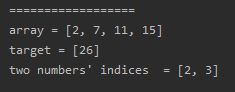
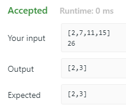

<!-- TOC -->

- [1. Easy Question: Two Sum](#1-easy-question-two-sum)
- [2. Solution](#2-solution)
  - [2.1. Approach 1: Brute Force](#21-approach-1-brute-force)
    - [2.1.1. Run Code Result](#211-run-code-result)
    - [2.1.2. Complexity Analysis](#212-complexity-analysis)

<!-- /TOC -->

## 1. Easy Question: Two Sum

Given an array of integers, return **indices** of the two numbers such that they add up to a specific target.

You may assume that each input would have **exactly** one solution, and you may not use the same element twice.

**Example:**

>Given nums = [2, 7, 11, 15], target = 9,  
>
>Because nums[0] + nums[1] = 2 + 7 = 9,  
>return [0, 1].

## 2. Solution

### 2.1. Approach 1: Brute Force
- use the easy way which is brute force to slove
- Loop through each element x and find if there is another value that equals to target.

```java
class Solution {
    public int[] twoSum(int[] nums, int target) {
        int[] res = new int[2];
        for (int i = 0; i < nums.length; i++) {
            for (int j = i + 1; j < nums.length; j++) {
                if (nums[i] + nums[j] == target) {
                    res[0] = i;
                    res[1] = j;
                    return res;
                }
            }
        }
        throw new IllegalArgumentException("No two sum solution");
    }
}
```

#### 2.1.1. Run Code Result
- result on local  
  
- result on website  


#### 2.1.2. Complexity Analysis
- Time Complexity: O(n<sup>2</sup>).  
  Cuz we have to loop through the array for each element which takes O(n) time.

- Space Complexity: O(1).