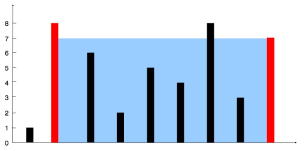
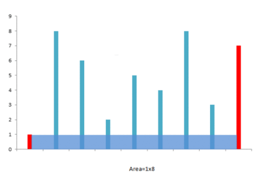
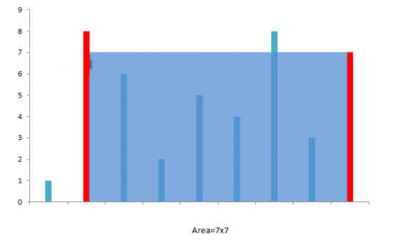
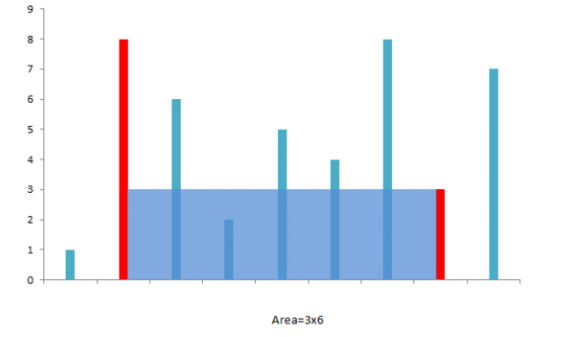
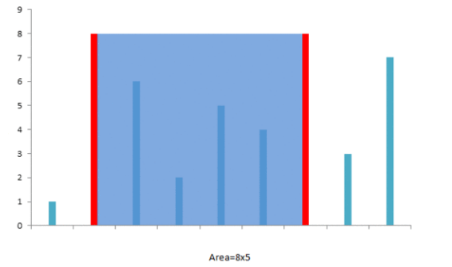
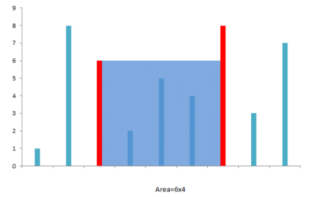
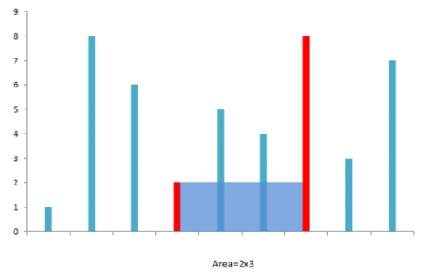
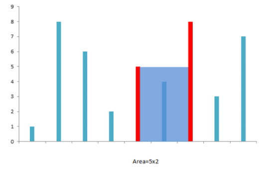
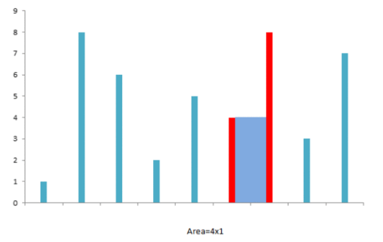

<!-- TOC -->

- [1. Easy Problrm: Container With Most Water](#1-easy-problrm-container-with-most-water)
- [2. Solution](#2-solution)
  - [2.1. Approach 1: Brute Force](#21-approach-1-brute-force)
    - [2.1.1. The Code](#211-the-code)
    - [2.1.2. Complexity Analysis](#212-complexity-analysis)
  - [2.2. Approach 2: Two Pointers](#22-approach-2-two-pointers)
    - [2.2.1. The Diagram](#221-the-diagram)
    - [2.2.2. The Code](#222-the-code)
    - [2.2.3. Complexity Analysis](#223-complexity-analysis)

<!-- /TOC -->

## 1. Easy Problrm: Container With Most Water
Given n non-negative integers `a1, a2,..., an`, where each represents a point at coordinate `(i, ai)`. `n` vertical lines are drawn such that the two endpoints of line `i` is at `(i, ai)` and `(i, 0)`. Find two lines, which together with `x-axis` forms a container, such that the container contains the most water.  

**Note:** You may not slant the container and n is at least 2.  

  

The above vertical lines are represented by array `[1,8,6,2,5,4,8,3,7]`.  
In this case, the max area of water (blue section) the container can contain is `49`.  

**Example:**

>Input: [1,8,6,2,5,4,8,3,7]  
>Output: 49

## 2. Solution

### 2.1. Approach 1: Brute Force
In this case, we will simply consider the area for every possible pair of the lines and find out the maximum area out of those.  

#### 2.1.1. The Code
```java
class Solution {
    public int maxArea(int[] height) {
        int maxarea = 0, l = 0, r = height.length - 1;
        while (l < r) {
            maxarea = Math.max(maxarea, Math.min(height[l], height[r]) * (r - l));
            if (height[l] < height[r])
                l++;
            else
                r--;
        }
        return maxarea;
    }
}
```

#### 2.1.2. Complexity Analysis
- Time Complexity: O(n<sup>2</sup>).
- Space Complexity: O(1).  


### 2.2. Approach 2: Two Pointers
The intuition behind this approach is that the area formed between the lines will always be limited by the height of the shorter line. Further, the farther the lines, the more will be the area obtained.

We take two pointers, one at the beginning and one at the end of the array constituting the length of the lines. Futher, we maintain a variable **maxarea** to store the maximum area obtained till now. At every step, we find out the area formed between them, update **maxarea** and move the pointer pointing to the shorter line towards the other end by one step.  

#### 2.2.1. The Diagram
The algorithm can be better understood by looking at the example below:  
>1 8 6 2 5 4 8 3 7

- step 1  
  

- step 2  
  

- step 3   
  

- step 4  
  

- step 5  
  
 
- step 6  
  

- step 7  
  

- step 8  
  

- And we can get the `max area = 49`

#### 2.2.2. The Code
```java
public class Solution {
    public int maxArea(int[] height) {
        int maxarea = 0, l = 0, r = height.length - 1;
        while (l < r) {
            maxarea = Math.max(maxarea, Math.min(height[l], height[r]) * (r - l));
            if (height[l] < height[r])
                l++;
            else
                r--;
        }
        return maxarea;
    }
}
```

#### 2.2.3. Complexity Analysis
- Time Complexity: O(n).
- Space Complexity: O(1).
