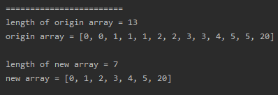
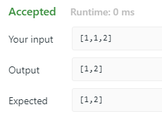

<!-- TOC -->

- [1. Easy Problem: Remove Duplicates from Sorted Array](#1-easy-problem-remove-duplicates-from-sorted-array)
- [2. Solution](#2-solution)
  - [2.1. Approach 1: Two Pointer](#21-approach-1-two-pointer)
    - [2.1.1. The Code](#211-the-code)
    - [2.1.2. Run Code Result](#212-run-code-result)
    - [2.1.3. Complexity Analysis](#213-complexity-analysis)

<!-- /TOC -->

## 1. Easy Problem: Remove Duplicates from Sorted Array

Given a sorted array nums, remove the duplicates **in-place** such that each element appear only once and return the new length.

Do not allocate extra space for another array, you must do this by **modifying the input array in-place** with O(1) extra memory.

**Example 1:**

>Given nums = [1,1,2],
>
>Your function should return length = 2, with the first two elements of nums being 1 and 2 respectively.
>
>It doesn't matter what you leave beyond the returned length.

**Example 2:**

>Given nums = [0,0,1,1,1,2,2,3,3,4],
>
>Your function should return length = 5, with the first five elements of nums being modified to 0, 1, 2, 3, and 4 respectively.
>
>It doesn't matter what values are set beyond the returned length.

## 2. Solution

### 2.1. Approach 1: Two Pointer
- We can define two pointers to slove this problem.
  - One pointer is `d_pointer`, another is `e_pointer`.
  - `d_pointer` is pointed to the place where the element first occured in the array.
  - `e_pointer` is used to compare the element pointed by it  
  to the element pointed by `d_pointer`.

- `d_pointer` is the slow_runner while `e_pointer` is the fast-runner.

- Init two pointers. `d_pointer = 0; e_pointer = 1;` And begin the loop;

- If `Array[e_pointer] == Array[d_pointer]`, we increment `e_pointer` to skip the duplicate.

- If `Array[e_pointer] != Array[d_pointer]`, which proves that a new element occured,  
  then we should put it before the duplicates have looped through,  
  so we copy the value of `Array[e_pointer]` to `Array[d_pointer + 1]`,  
  then we increment the `e_pointer`.

- Repeat the same process until `e_pointer` is out of the array's bound.

#### 2.1.1. The Code
```java
public int removeDuplicates(int[] nums) {
    if (nums.length == 0) return 0;
    //define two pointers for loop through the array
    //one is pointer for duplicates, another pointer is just for point to array's elements
    int d_point = 0;
    int e_point = 1;

    //the e_point should not be out of the array's bound,
    //therefore we should end the loop when it's out of bound
    while (e_point < nums.length) {
        if (nums[e_point] != nums[d_point]) {
            nums[++d_point] = nums[e_point];
        }
        e_point++;
    }
    //the length of array is the indice which is d_point add 1
    return d_point + 1;
}
```


#### 2.1.2. Run Code Result
- result on local  

- result on website  


#### 2.1.3. Complexity Analysis

- Time complextiy: O(n).  
  Assume that n is the length of array.  
  Each of pointer traverses at most n steps.

- Space complexity: O(1).