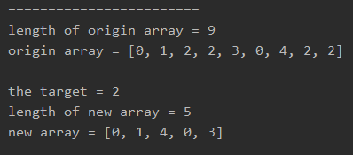
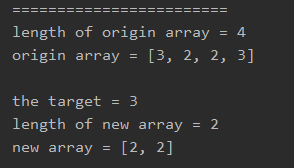
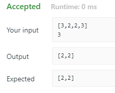

<!-- TOC -->

- [1. Easy Problem: Remove Element](#1-easy-problem-remove-element)
- [2. Slution](#2-slution)
  - [2.1. Approach 1: Two Pointer](#21-approach-1-two-pointer)
    - [2.1.1. Run Code Result](#211-run-code-result)
    - [2.1.2. Complexity Analysis](#212-complexity-analysis)

<!-- /TOC -->

## 1. Easy Problem: Remove Element
Given an array nums and a value val, remove all instances of that value **in-place** and return the new length.

Do not allocate extra space for another array, you must do this by **modifying the input array in-place** with O(1) extra memory.

The order of elements can be changed. It doesn't matter what you leave beyond the new length.

**Example 1:**

>Given nums = [3,2,2,3], val = 3,
>
>Your function should return length = 2, with the first two elements of nums being 2.
>
>It doesn't matter what you leave beyond the returned length.

**Example 2:**

>Given nums = [0,1,2,2,3,0,4,2], val = 2,
>
>Your function should return length = 5, with the first five elements of nums containing 0, 1, 3, 0, and 4.
>
>Note that the order of those five elements can be arbitrary.
>
>It doesn't matter what values are set beyond the returned length.

## 2. Slution

### 2.1. Approach 1: Two Pointer
- When we encounter `nums[pointer] = val`, we can swap the current element out with the last element and dispose the last one. This essentially reduces the array's size by 1.

- Note that the last element that was swapped in could be the value you want to remove itself. But don't worry, in the next iteration we will still check this element.
```java
public int removeElement(int[] nums, int val) {
    if (nums.length == 0) return 0;
    //define two pointer
    //one is pointed to the head of array, from head to tail
    //another is pointed to the tail of array, which is equals to array's length
    int pointer = 0;
    int length = nums.length;

    //so the pointer should be less than array's length to avoid being out of bound
    while (pointer < length) {
        //when we find a duplicate the length sub 1
        if (nums[pointer] == val) {
            nums[pointer] = nums[length - 1];
            length--;
        } else {
            pointer++;
        }
    }
    return length;
}
```

#### 2.1.1. Run Code Result
- results on local  
  
  
  
- result on website  
  

#### 2.1.2. Complexity Analysis

- Time complexity : O(n). Both pointer traverse at most n steps. In this approach, the number of assignment operations is equal to the number of elements to remove. So it is more efficient if elements to remove are rare.

- Space complexity : O(1).