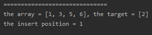
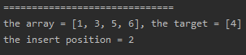
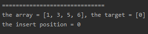
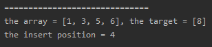
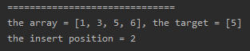

<!-- TOC -->

- [1. Easy Problem: Search Insert Position](#1-easy-problem-search-insert-position)
- [2. Solution](#2-solution)
  - [2.1. Approach 1: Binary Search](#21-approach-1-binary-search)
    - [2.1.1. Run Code Result](#211-run-code-result)
    - [2.1.2. Complexity analysis](#212-complexity-analysis)

<!-- /TOC -->

## 1. Easy Problem: Search Insert Position
Given a sorted array and a target value, return the index if the target is found.  
If not, return the index where it would be if it were inserted in order.

You may assume no duplicates in the array.

**Example 1:**

>Input: [1,3,5,6], 5  
>Output: 2  

**Example 2:**

>Input: [1,3,5,6], 2  
>Output: 1  

**Example 3:**

>Input: [1,3,5,6], 7  
>Output: 4   

**Example 4:**

>Input: [1,3,5,6], 0  
>Output: 0

## 2. Solution

### 2.1. Approach 1: Binary Search
```java
class Solution {
    public int searchInsert(int[] nums, int target) {
        //if the target is less than the minimum or greater than the maximum,
        //it would must be inserted into the array, cuz it can't not be found,
        //therefore, we can return the position where it could be inserted
        if (target > nums[nums.length - 1]) {
            return nums.length;
        }
        if (target < nums[0]) {
            return 0;
        }

        //define three pointer, one points to array's head, another points to tali
        //the last one is point to mid element
        int h_point = 0;
        int t_point = nums.length - 1;
        int m_point;

        //cuz the array has been sorted, so that if we want to find a value, we can use binary search.
        //keep h_point <= t_point, regard h_point as the first element in the array and t_point is the last one.
        //if h_point = t_point, you can assume the array has only one element.
        while (h_point <= t_point) {
            //init the m_point
            m_point = (h_point + t_point) / 2;

            //compare with the target
            if (nums[m_point] == target) {
                return m_point;
            }
            //no need to compare with the nums[m_point] again, decrease the m_point
            else if (nums[m_point] > target) {
                t_point = m_point - 1;
            }
            //same reason, increase the m_point
            else {
                h_point = m_point + 1;
            }
        }

        //if the loop succeeds to finish, it proves that the target is not existed,
        //return the position where the target can be inserted
        return t_point + 1;
    }
}
```

#### 2.1.1. Run Code Result
  
  
  
  


#### 2.1.2. Complexity analysis
- Time complexity : O(log<sub>2</sub>n).
- Space complexity : O(1).