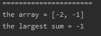
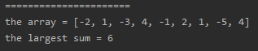

<!-- TOC -->

- [1. Easy Problem: Maximum Subarray](#1-easy-problem-maximum-subarray)
- [2. Solution](#2-solution)
  - [2.1. Approach 1: Brute Force](#21-approach-1-brute-force)
    - [2.1.1. The Code](#211-the-code)
    - [2.1.2. Run Code Result](#212-run-code-result)
    - [2.1.3. Complexity Analysis](#213-complexity-analysis)
  - [2.2. Approach 2: Greedy Algorithm](#22-approach-2-greedy-algorithm)
    - [2.2.1. The Code](#221-the-code)
    - [2.2.2. Run Code Result](#222-run-code-result)
    - [2.2.3. Complexity Analysis](#223-complexity-analysis)

<!-- /TOC -->

## 1. Easy Problem: Maximum Subarray
Given an integer array nums, find the contiguous subarray (containing at least one number) which has the largest sum and return its sum.

**Example:**

>Input: [-2, 1, -3, 4, -1, 2, 1, -5, 4],  
>Output: 6  
>Explanation: [4, -1, 2, 1] has the largest sum = 6.

**Follow up:**

If you have figured out the O(n) solution, try coding another solution using the divide and conquer approach, which is more subtle.

## 2. Solution

### 2.1. Approach 1: Brute Force
- use 2 loops to add up each element and the elements after them

#### 2.1.1. The Code
```java
class Solution {
    public int maxSubArray(int[] nums) {
        int sum = 0;
        int max = nums[0];
        for (int i = 0; i < nums.length; i++) {
            for (int j = i; j < nums.length; j++) {
                sum += nums[j];
                max = Math.max(max, sum);
            }
            sum = 0;
        }
        return max;
    }
}
```

#### 2.1.2. Run Code Result


#### 2.1.3. Complexity Analysis
- Time Complexity: O(n<sup>2</sup>)
- Space Complexity: O(1)

****

### 2.2. Approach 2: Greedy Algorithm
- we can use loop for only one time to solve this problem,
- and we have to reset the largest sum when it is less than 0.
- cuz minus add up with other number will always decrease another number,
- therefore the largest sum should be reset to 0 when it's less than 0.

#### 2.2.1. The Code
```java
class Solution {
    public static int maxSubArray(int[] nums) {
        int sum = 0;
        int max = nums[0];

        for (int j = 0; j < nums.length; j++) {
            sum += nums[j];
            max = Math.max(max, sum);
            if (sum < 0) sum = 0;
        }

        return max;
    }
}
```

#### 2.2.2. Run Code Result


#### 2.2.3. Complexity Analysis
- Time Complexity: O(n).  
  This approach needs only one loop.
- Space Complexity: O(1)