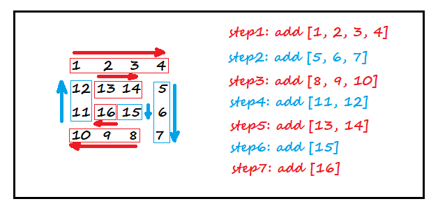
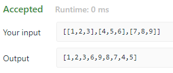

<!-- TOC -->

- [1. Medium Problem: Spiral Matrix](#1-medium-problem-spiral-matrix)
- [2. Solution](#2-solution)
  - [2.1. Approach 1: Divide into 4 Situations](#21-approach-1-divide-into-4-situations)
  - [2.2. The Code](#22-the-code)
    - [2.2.1. Run Code Result](#221-run-code-result)
    - [2.2.2. Complexity Analysis](#222-complexity-analysis)

<!-- /TOC -->

## 1. Medium Problem: Spiral Matrix
Given a matrix of m x n elements (m rows, n columns),  
return all elements of the matrix in spiral order.  

**Example 1:**  
```java
Input:
[
 [ 1, 2, 3 ],
 [ 4, 5, 6 ],
 [ 7, 8, 9 ]
]

Output: [1,2,3,6,9,8,7,4,5]
```

**Example 2:**  
```java
Input:
[
  [1, 2, 3, 4],
  [5, 6, 7, 8],
  [9,10,11,12]
]

Output: [1,2,3,4,8,12,11,10,9,5,6,7]
```

## 2. Solution

### 2.1. Approach 1: Divide into 4 Situations
- Here is a sample matrix:  
  ```java
  {
      {1,   2,  3,  4},
      {12, 13, 14,  5},
      {11, 16, 15,  6},
      {10,  9,  8,  7}
  }
  ```

- We should add the elements in matrix clockwise as requested.  
  And here is the diagram.
  

- We can divide this process into 2 parts.  
  - One part is adding elements to list breadthwise.  
  - The other part is adding lengthways.

- Then we can continue divide these parts into 4 parts  
  according to its adding direction.
  - Forard direction, the index of row/col is increasing.
  - Backward direction, the index of row/col is decreasing.

- The amount of pending actions is one less per round.
  - The amount of red part is from `arr.length` to 1.
  - The blue part is from `arr[0].length - 1` to 1.

### 2.2. The Code
```java
class Solution {
    public List<Integer> spiralOrder(int[][] matrix) {
        List<Integer> resList = new ArrayList<>();

        if (matrix.length == 0) return resList;

        int row_ptr = 0;
        int col_ptr = 0;

        int row_ul = matrix[0].length;
        int col_ul = matrix.length - 1;
        int count = 0;

        int round = 0;
        int ele_count = matrix.length * matrix[0].length;


        while (ele_count > 0) {
            switch (round % 4) {
                case 0:
                    while (count < row_ul) {
                        resList.add(matrix[row_ptr][col_ptr]);
                        col_ptr++;
                        count++;
                    }
                    ele_count -= row_ul;
                    col_ptr--;
                    row_ptr++;
                    row_ul--;
                    count = 0;
                    round++;
                    break;
                case 1:
                    while (count < col_ul) {
                        resList.add(matrix[row_ptr][col_ptr]);
                        row_ptr++;
                        count++;
                    }
                    ele_count -= col_ul;
                    row_ptr--;
                    col_ptr--;
                    col_ul--;
                    count = 0;
                    round++;
                    break;
                case 2:
                    while (count < row_ul) {
                        resList.add(matrix[row_ptr][col_ptr]);
                        col_ptr--;
                        count++;
                    }
                    ele_count -= row_ul;
                    col_ptr++;
                    row_ptr--;
                    row_ul--;
                    count = 0;
                    round++;
                    break;
                case 3:
                    while (count < col_ul) {
                        resList.add(matrix[row_ptr][col_ptr]);
                        row_ptr--;
                        count++;
                    }
                    ele_count -= col_ul;
                    row_ptr++;
                    col_ptr++;
                    col_ul--;
                    count = 0;
                    round++;
                    break;
            }
        }

        return resList;
    }
}
```

#### 2.2.1. Run Code Result


#### 2.2.2. Complexity Analysis
- Time Complexity: O(n)
- Space Complexity: O(1)