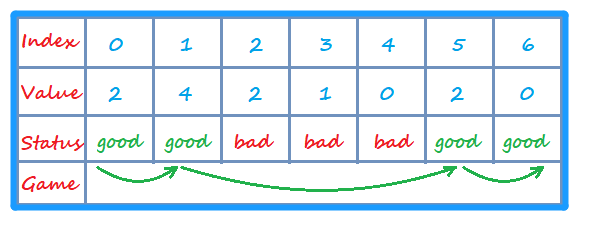

<!-- TOC -->

- [1. Medium Problem: Jump Game](#1-medium-problem-jump-game)
- [2. Solution](#2-solution)
  - [2.1. Approach 1: Backtracking](#21-approach-1-backtracking)
    - [2.1.1. The Code](#211-the-code)
    - [2.1.2. Complexity Analysis](#212-complexity-analysis)
  - [2.2. Approach 2: Greedy](#22-approach-2-greedy)
    - [2.2.1. The Diagram](#221-the-diagram)
    - [2.2.2. The Code](#222-the-code)
    - [2.2.3. Complexity Analysis](#223-complexity-analysis)

<!-- /TOC -->

## 1. Medium Problem: Jump Game
Given an array of non-negative integers, you are initially positioned at the first index of the array.

Each element in the array represents your maximum jump length at that position.

Determine if you are able to reach the last index.

**Example 1:**
```java
Input: nums = [2,3,1,1,4]
Output: true
Explanation: Jump 1 step from index 0 to 1, then 3 steps to the last index.
```

**Example 2:**
```java
Input: nums = [3,2,1,0,4]
Output: false
Explanation: You will always arrive at index 3 no matter what.  
Its maximum jump length is 0, which makes it impossible to reach the last index.
``` 

**Constraints:**
```java
1 <= nums.length <= 3 * 10^4  
0 <= nums[i][j] <= 10^5
```

## 2. Solution

### 2.1. Approach 1: Backtracking  
- This is the inefficient solution where we try every single jump pattern  
that takes us from the first position to the last.  
- We start from the first position and jump to every index that is reachable.  
- We repeat the process until last index is reached. When stuck, backtrack.

#### 2.1.1. The Code
```java
class solution{
    public static boolean canJump(int[] nums) {
        int cur_index = 0;
        return recursion(nums, cur_index);
    }

    public static boolean recursion(int[] nums, int cur_index){
        int step = nums[cur_index];
        if (cur_index + step >= nums.length - 1) {
            return true;
        }
        while (step > 0) {
            if(recursion(nums, cur_index + step)) return true;
            step--;
        }
        return false;
    }
}
```

#### 2.1.2. Complexity Analysis
- Time Complexity: O(2<sup>n</sup>) 
- Space Complexity: O(n) 


### 2.2. Approach 2: Greedy
- We can assume that there are 2 status of the position of elements in array.
  
  - One is good position which can make target reach to the end.  
    
    - If a target wants to reach the end point from the start point,  
      it has to arrive one good position to next good position till the end.  
    
    - It can only reach the good position during the game.  
    
    - Therefore, the start point should also be the good position  
      to make sure the target can finish the game.

  - Another is bad position. The target cant reach end point in this position.
    
    - Bad position means that no target can arrive good position in this status.
    
    - Therefore, target cant finish the game if start point is in bad position.

- The defination of good/bad position:  
  
  - The end point must be the good position.
  
  - If the sum of an element's index and value is larger than  
    the index of the next good point which is closest to current point,  
    this current point is good point. 

  - If the sum of an element's index and value is less than  
    the index of the next good point which is closest to current point,  
    this current point is bad point.

#### 2.2.1. The Diagram
- Maybe not each good position should be visited sometime,  
  but we can assume that the target had visited every good point.
- So that every good point must be visited.  


#### 2.2.2. The Code
```java
class Solution {
    public boolean canJump(int[] nums) {
        if (nums.length == 0) return false;
        
        //define two pointers
        //ele_ptr is used to point to elements
        //g_ptr is used to point to good point
        int ele_ptr = nums.length - 1;
        int g_ptr = nums.length - 1;
        
        //define an array to store every position's status
        int[] status_arr = new int[nums.length];

        while (ele_ptr >= 0) {
            //judge the status of current point
            if ((nums[ele_ptr] + ele_ptr) >= g_ptr) {
                status_arr[ele_ptr] = 1;
                g_ptr = ele_ptr;
            }
            ele_ptr--;
        }

        return (status_arr[0] == 1);
    }
}
```

#### 2.2.3. Complexity Analysis
- Time Complexity: O(n).
- Space Complexity: O(n).