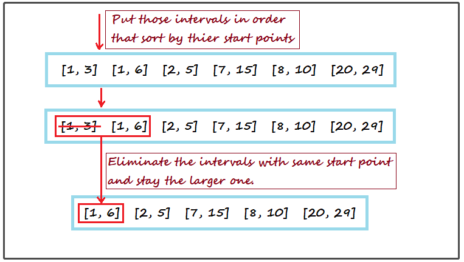
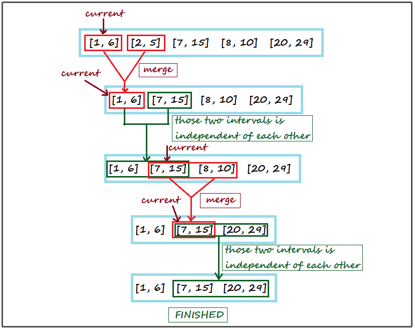

<!-- TOC -->

- [1. Medium Problem: Merge Invertals](#1-medium-problem-merge-invertals)
- [2. Solution](#2-solution)
  - [2.1. Approach 1: Sort By Using TreeMap](#21-approach-1-sort-by-using-treemap)
    - [2.1.1. The Code](#211-the-code)
    - [2.1.2. Complexity Analysis](#212-complexity-analysis)

<!-- /TOC -->

## 1. Medium Problem: Merge Invertals
Given a collection of intervals, merge all overlapping intervals.

**Example 1:**
```java
Input: intervals = [[1,3],[2,6],[8,10],[15,18]]

Output: [[1,6],[8,10],[15,18]]

Explanation: Since intervals [1,3] and [2,6] overlaps, merge them into [1,6].
```

**Example 2:**
```java
Input: intervals = [[1,4],[4,5]]

Output: [[1,5]]

Explanation: Intervals [1,4] and [4,5] are considered overlapping.
```

**Constraints:**

`intervals[i][0] <= intervals[i][1]`

## 2. Solution

### 2.1. Approach 1: Sort By Using TreeMap
- Cuz we should put those intervals in order that sort by thier start points  
  so that we can eliminate the intervals with same start point and stay the larger one.  
  

- Then merge the intervals, here are the rules:  
  
  - We should define a pointer to point to the current interval,  
    cuz we dont know if the next interval is not overlapping.  
    - We consider current interval is overlapping with next interval,  
      so the pointer is pointed to it.
      
    - If currtent interval is not overlapping with the next,  
      the pointer will be changed to point the next.
  
  - If current interval's end point is equalled or larger than next's start point,  
    it proves that these two intervals are considered overlapping.  
    Therefore, we should merge these intervals.
    
    - Firstly, get the new end point of the new interval.  
      We should get the max value which is the new end point  
      between current interval's end point and the next's end point.
    
    - Finally, get the new start point of the new interval.  
      Current interval's start point is must less than the next,  
      cuz we have sorted those intervals according to their start points,  
      so the new start point is equalloed to current interval's start point.

    - Add the new interval to arraylist which is used to return the result,  
      and the pointer should be changed to point to it.

  - If current interval's end point is less than next's start point,  
    it proves that those two intervals are independent of each other.  
    
    - Add the next interval to arraylist which is used to return the result,  
      and the pointer should be changed to point to it.

  

****

#### 2.1.1. The Code
```java
class Solution {
    public int[][] merge(int[][] intervals) {
        Map<Integer, Integer> treeMap = new TreeMap<>();

        for (int i = 0; i < intervals.length; i++) {
            if (treeMap.containsKey(intervals[i][0])) {
                treeMap.put(intervals[i][0], Math.max(intervals[i][1], treeMap.get(intervals[i][0])));
            } else {
                treeMap.put(intervals[i][0], intervals[i][1]);
            }
        }

        int count = 0;
        int temp_key = 0;
        int temp_val = 0;
        List<List> res_list = new ArrayList<>();
        for (Integer cur_key : treeMap.keySet()) {
            if (count == 0) {
                temp_key = cur_key;
                temp_val = treeMap.get(temp_key);
                count++;
            } else {
                if (temp_val >= cur_key) {
                    temp_val = Math.max(temp_val, treeMap.get(cur_key));
                } else {
                    res_list.add(new ArrayList(Arrays.asList(temp_key, temp_val)));
                    temp_key = cur_key;
                    temp_val = treeMap.get(cur_key);
                }
            }
        }
        
        if (res_list.size() == 0 || (int) res_list.get(res_list.size() - 1).get(0) != temp_key) {
            if (!(temp_key == 0 && temp_val == 0)) {
                res_list.add(new ArrayList(Arrays.asList(temp_key, temp_val)));
            }
        }

        int[][] res = new int[res_list.size()][2];
        for (int i = 0; i < res_list.size(); i++) {
            res[i] = new int[]{(int) res_list.get(i).get(0), (int) res_list.get(i).get(1)};
        }
        return res;
    }
}

```

#### 2.1.2. Complexity Analysis
- Time Complexity: O(nlogn)
- Space Complexity: O(n)