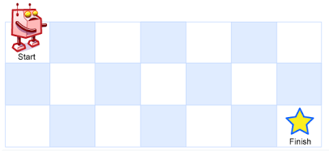
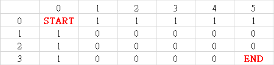
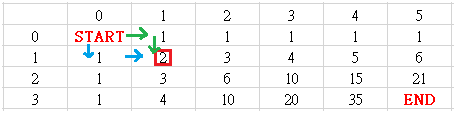
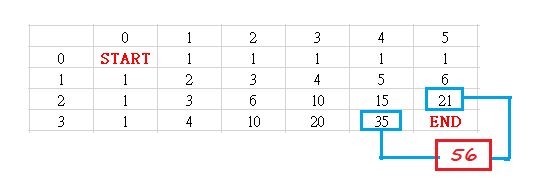

<!-- TOC -->

- [1. Medium Problem: Unique Paths](#1-medium-problem-unique-paths)
- [2. Solution](#2-solution)
  - [2.1. Approach 1: Dynamic Programming](#21-approach-1-dynamic-programming)
    - [2.1.1. The Code](#211-the-code)
    - [2.1.2. Complexity Analysis](#212-complexity-analysis)

<!-- /TOC -->

## 1. Medium Problem: Unique Paths
A robot is located at the top-left corner of a m x n grid (marked 'Start' in the diagram below).

The robot can only move either down or right at any point in time.  
The robot is trying to reach the bottom-right corner of the grid (marked 'Finish' in the diagram below).

How many possible unique paths are there?

**Example 1:**  

```
Input: m = 3, n = 7
Output: 28
```

**Example 2:**  
```
Input: m = 3, n = 2
Output: 3

Explanation:
From the top-left corner, there are a total of 3 ways to reach the bottom-right corner:
1. Right -> Down -> Down
2. Down -> Down -> Right
3. Down -> Right -> Down
```

**Example 3:**
```
Input: m = 7, n = 3
Output: 28
```
**Example 4:**
```
Input: m = 3, n = 3
Output: 6
``` 

**Constraints:**
>
>1 <= m, n <= 100  
>It's guaranteed that the answer will be less than or equal to 2 * 10<sup>9</sup>.


## 2. Solution

### 2.1. Approach 1: Dynamic Programming
- We can draw a grid to show the process.  
- Firstly, we get the grid like this.  
  - Each element is the number of the ways to this point.
  - All the elements in first row/col are 1 and the rest are 0.  
  - Cuz these is only one way to reach these points having index (0,i).  
    i.e->(0,1)->(0,2)->(0,3)->--so on till (0,m) and it is by moving right from (0,0).  
  - So it's same to the points with index (i,0).
    

- Then we can get the ways of the rest of points.  
  - Here is a example for the ways to point with index (1,1).  
  - Abviously, there are 2 ways to this point.  
  And the number of ways is the sum of this point's top and left elements.
  

- So the rest elements are the sum of their top and left elements.  
  - And we can get the final result -- the number of ways to end point.  
  

#### 2.1.1. The Code
```java
class Solution {
    public int uniquePaths(int m, int n) {
        int[][] grid = new int[m][n];
        for (int i = 0; i < m; i++) {
            for (int j = 0; j < n; j++) {
                if (i == 0 || j == 0)
                    grid[i][j] = 1;
                else
                    grid[i][j] = grid[i][j - 1] + grid[i - 1][j];
            }
        }
        return grid[m - 1][n - 1];
    }
}
```

#### 2.1.2. Complexity Analysis
- Time complexity: O(n).
- Space complexity: O(n).