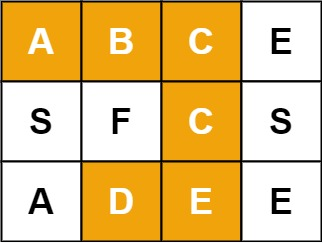
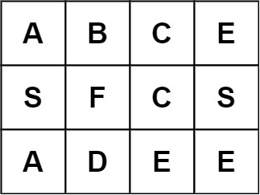
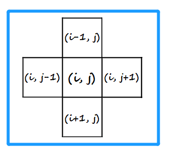

<!-- TOC -->

- [1. Medium Problem: Word Search](#1-medium-problem-word-search)
- [2. Solution](#2-solution)
  - [2.1. Approach 1: Backtracking Recursion](#21-approach-1-backtracking-recursion)
    - [2.1.1. The code](#211-the-code)
    - [2.1.2. Complexity Analysis](#212-complexity-analysis)

<!-- /TOC -->

## 1. Medium Problem: Word Search
Given an `m x n` board and a word, find if the word exists in the grid.

The word can be constructed from letters of sequentially adjacent cells,  
where "adjacent" cells are horizontally or vertically neighboring.  
The same letter cell may not be used more than once.

**Example 1:**  
  
```java
Input: board = [["A","B","C","E"],["S","F","C","S"],["A","D","E","E"]], 
        word = "ABCCED"
Output: true
```

**Example 2:**  
  
```java
Input: board = [["A","B","C","E"],["S","F","C","S"],["A","D","E","E"]], 
        word = "SEE"
Output: true
```

**Example 3:**  
  
```java
Input: board = [["A","B","C","E"],["S","F","C","S"],["A","D","E","E"]], 
        word = "ABCB"
Output: false
```

## 2. Solution

### 2.1. Approach 1: Backtracking Recursion
- When find the right letter equaled to the one in requested position of word,  
  we can compare all the letters in four directions of the current letter.  
  

- There are two limits to visited the letter in four directions:  
  1. The index of the letter should not be out of the bound.
  2. The visited status of the letter should be 0 (not visited).

- When we visited the letter we should set its visited status to `1`  
  whether it's equaled to the target or not.  

- Then if it's equaled to the target we can start the recirsion.  
  Starting compare the next letter in four directions.  

- If the current letter or the letters in four directions isnt equaled to target,  
  we should reset the visited status.

- When `index_of_target == word.length() -1` we should end the recursion.    
  - If current char is equaled to target set the result to true and return.
  - If current char isnt equaled to target return directly.


#### 2.1.1. The code
```java
class Solution {
    public boolean exist(char[][] board, String word) {
        //define a 2D array to store the visit status of each letter
        //'0' is unvisited; '1' is visited.
        int[][] status = new int[board.length][board[0].length];

        //store the result
        boolean[] res = new boolean[1];

        //loop to find the right first letter
        for (int i = 0; i < board.length; i++) {
            for (int j = 0; j < board[0].length; j++) {
                recursion(board[i][j], 0, word, board, i, j, status, res);
            }
        }

        //return the result
        return res[0];
    }

    public static void recursion(char c, int index, String word, char[][] board, int row, int col, int[][] visited, boolean[] res) {
        //we should make sure whether the word is existed in the matrix,
        //once the word is occurred then it's no need to continue the recursion.
        if (res[0]) return;

        //update the status of current char
        visited[row][col] = 1;

        //define the way out of recursion
        if (index == word.length() - 1) {
            if (c == word.charAt(index)) {
                res[0] = true;
            }
            return;
        }

        //start recursion
        //the next point's index shouldn't be out of the bound
        //and it must not be visited cuz the same letter cell may not be used more than once.
        if (c == word.charAt(index)) {
            //up
            if (row - 1 >= 0 && visited[row - 1][col] == 0)
                recursion(board[row - 1][col], index + 1, word, board, row - 1, col, visited, res);

            //down
            if (row + 1 < board.length && visited[row + 1][col] == 0)
                recursion(board[row + 1][col], index + 1, word, board, row + 1, col, visited, res);

            //left
            if (col - 1 >= 0 && visited[row][col - 1] == 0)
                recursion(board[row][col - 1], index + 1, word, board, row, col - 1, visited, res);

            //right
            if (col + 1 < board[0].length && visited[row][col + 1] == 0)
                recursion(board[row][col + 1], index + 1, word, board, row, col + 1, visited, res);
        }

        //backtrack, reset the status
        visited[row][col] = 0;
    }
}
```

#### 2.1.2. Complexity Analysis
- Time Complexity: O(n<sup>2</sup>).
- Space Complexity: O(n).