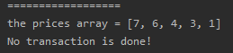

<!-- TOC -->

- [1. Easy Problem: Best Time to Buy and Sell Stock](#1-easy-problem-best-time-to-buy-and-sell-stock)
- [2. Solution](#2-solution)
  - [2.1. Approach 1: Brute Force](#21-approach-1-brute-force)
    - [2.1.1. Run Code Result](#211-run-code-result)
    - [2.1.2. Complexity analysis](#212-complexity-analysis)
  - [2.2. Approach 2:](#22-approach-2)

<!-- /TOC -->

## 1. Easy Problem: Best Time to Buy and Sell Stock
Say you have an array for which the i<sup>th</sup> element is the price of a given stock on day i.

If you were only permitted to complete at most one transaction (i.e., buy one and sell one share of the stock), design an algorithm to find the maximum profit.

Note that you cannot sell a stock before you buy one.

**Example 1:**

>Input: [7,1,5,3,6,4]  
>Output: 5  
>Explanation:  
>Buy on day 2 (price = 1) and sell on day 5 (price = 6), profit = 6-1 = 5.  
>Not 7-1 = 6, as selling price needs to be larger than buying price.

**Example 2:**

>Input: [7,6,4,3,1]  
>Output: 0  
>Explanation: In this case, no transaction is done, i.e. max profit = 0.

## 2. Solution

### 2.1. Approach 1: Brute Force
- We can find the max profit by looping through the prices array 2 times.  
- Loop the array from it's tali to head so that we can get positive result.

```java
class Solution {
    public int maxProfit(int[] prices) {
        int maxProfit = 0;
        for (int i = prices.length - 1; i >= 0; i--) {
            for (int j = i - 1; j >= 0; j--) {
                maxProfit = Math.max(maxProfit, prices[i] - prices[j]);
            }
        }
        if (maxProfit <= 0) {
            return 0;
        }
        return maxProfit;
    }
}
```

#### 2.1.1. Run Code Result
  

#### 2.1.2. Complexity analysis
- Time Complexity: O(n<sup>2</sup>).  
- Space Complexity: O(1).

****

### 2.2. Approach 2: