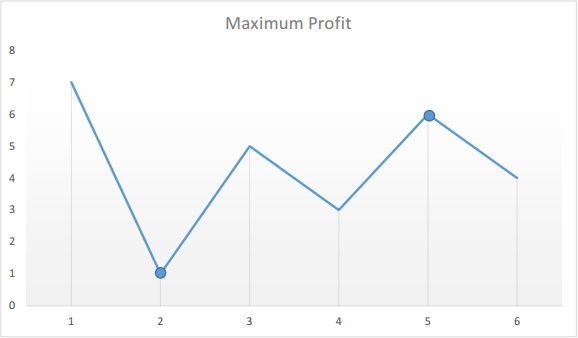

<!-- TOC -->

- [1. Easy Problem: Best Time to Buy and Sell Stock](#1-easy-problem-best-time-to-buy-and-sell-stock)
- [2. Solution](#2-solution)
  - [2.1. Approach 1: Brute Force](#21-approach-1-brute-force)
    - [2.1.1. The Code](#211-the-code)
    - [2.1.2. Run Code Result](#212-run-code-result)
    - [2.1.3. Complexity analysis](#213-complexity-analysis)
  - [2.2. Approach 2: One Pass](#22-approach-2-one-pass)
    - [2.2.1. The Code](#221-the-code)
    - [2.2.2. Complexity Analysis](#222-complexity-analysis)

<!-- /TOC -->

## 1. Easy Problem: Best Time to Buy and Sell Stock
Say you have an array for which the i<sup>th</sup> element is the price of a given stock on day i.

If you were only permitted to complete at most one transaction (i.e., buy one and sell one share of the stock), design an algorithm to find the maximum profit.

Note that you cannot sell a stock before you buy one.

**Example 1:**

>Input: [7,1,5,3,6,4]  
>Output: 5  
>Explanation:  
>Buy on day 2 (price = 1) and sell on day 5 (price = 6), profit = 6-1 = 5.  
>Not 7-1 = 6, as selling price needs to be larger than buying price.

**Example 2:**

>Input: [7,6,4,3,1]  
>Output: 0  
>Explanation: In this case, no transaction is done, i.e. max profit = 0.

## 2. Solution

### 2.1. Approach 1: Brute Force
- We can find the max profit by looping through the prices array 2 times.  
- Loop the array from it's tali to head so that we can get positive result.

#### 2.1.1. The Code
```java
class Solution {
    public int maxProfit(int[] prices) {
        int maxProfit = 0;
        for (int i = prices.length - 1; i >= 0; i--) {
            for (int j = i - 1; j >= 0; j--) {
                maxProfit = Math.max(maxProfit, prices[i] - prices[j]);
            }
        }
        if (maxProfit <= 0) {
            return 0;
        }
        return maxProfit;
    }
}
```

#### 2.1.2. Run Code Result
  

#### 2.1.3. Complexity analysis
- Time Complexity: O(n<sup>2</sup>).  
- Space Complexity: O(1).

****

### 2.2. Approach 2: One Pass
- Loop through the array for one time to get the min price and max profit.

- If we plot the numbers of the given array on a graph, we get:  
  

- The points of interest are the peaks and valleys in the given graph.  
- We need to find the largest peak following the smallest valley.  
- We can maintain two variables - minprice and maxprofit corresponding to  
  the smallest valley and maximum profit (maximum difference between  
  selling price and minprice) obtained so far respectively.

#### 2.2.1. The Code
```java
class Solution {
    public int maxProfit(int[] prices) {
        int minprice = Integer.MAX_VALUE;
        int maxprofit = 0;
        for (int i = 0; i < prices.length; i++) {
            if (prices[i] < minprice)
                minprice = prices[i];
            else if (prices[i] - minprice > maxprofit)
                maxprofit = prices[i] - minprice;
        }
        return maxprofit;
    }
}
```

#### 2.2.2. Complexity Analysis
- Time Complexity: O(n). Cuz deal with it by only one loop.
- Space Complexity: O(1).