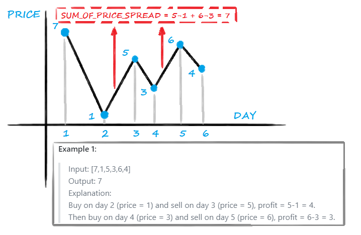
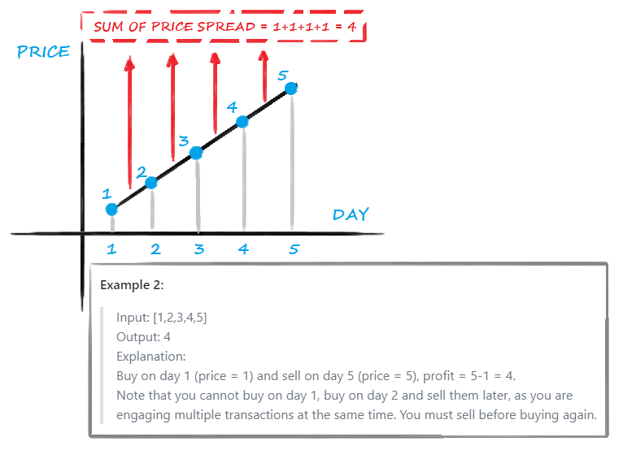
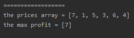
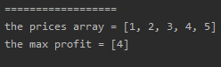
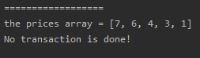

<!-- TOC -->

- [1. Easy Problem: Best Time to Buy and Sell Stock II](#1-easy-problem-best-time-to-buy-and-sell-stock-ii)
- [2. Solution](#2-solution)
  - [2.1. Approach 1: One Pass](#21-approach-1-one-pass)
    - [2.1.1. Run Code Result](#211-run-code-result)
    - [2.1.2. Complexity Analysis](#212-complexity-analysis)

<!-- /TOC -->

## 1. Easy Problem: Best Time to Buy and Sell Stock II
Say you have an array prices for which the i<sup>th</sup> element is the price of a given stock on day i.  

Design an algorithm to find the maximum profit. You may complete as many transactions as you like (i.e., buy one and sell one share of the stock multiple times).  

**Note:** You may not engage in multiple transactions at the same time (i.e., you must sell the stock before you buy again).  

**Example 1:**

>Input: [7,1,5,3,6,4]  
Output: 7  
Explanation:  
Buy on day 2 (price = 1) and sell on day 3 (price = 5), profit = 5-1 = 4.  
Then buy on day 4 (price = 3) and sell on day 5 (price = 6), profit = 6-3 = 3.

**Example 2:**

>Input: [1,2,3,4,5]  
Output: 4  
Explanation:  
Buy on day 1 (price = 1) and sell on day 5 (price = 5), profit = 5-1 = 4.  
Note that you cannot buy on day 1, buy on day 2 and sell them later, as you are  
engaging multiple transactions at the same time. You must sell before buying again.

**Example 3:**

>Input: [7,6,4,3,1]  
Output: 0  
Explanation: In this case, no transaction is done, i.e. max profit = 0.
 

**Constraints:**

>1 <= prices.length <= 3 * 10 ^ 4  
0 <= prices[i] <= 10 ^ 4

## 2. Solution

### 2.1. Approach 1: One Pass
- We should catch every price spread between the low price and the high price.
- Add up all the price spread we got and the sum is the max profit.  
- Example 1:  
    

- Example 2:  
  


```java
class Solution {
    public int maxProfit(int[] prices) {
        int minPrice = Integer.MAX_VALUE;
        int maxProfit = 0;
        for (int i = 0; i < prices.length; i++) {
            if (prices[i] < minPrice) {
                minPrice = prices[i];
            } else if (prices[i] > minPrice) {
                maxProfit += prices[i] - minPrice;
                minPrice = prices[i];
            }
        }

        return maxProfit;
    }
}
```

#### 2.1.1. Run Code Result
- Example 1  
  
- Example 2  
  
- Example 3  
  

#### 2.1.2. Complexity Analysis
- Time Complexity: O(n).
- Space Complexity: O(1).