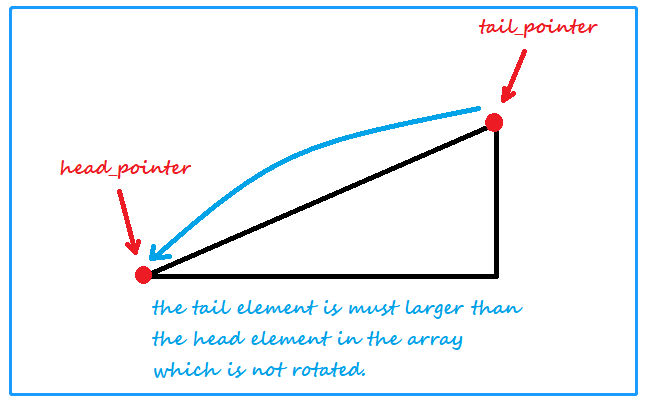
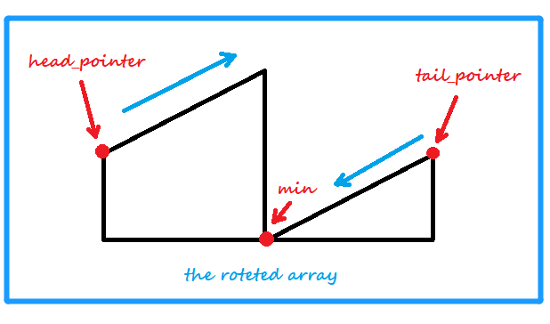

<!-- TOC -->

- [1. Medium Problem: Find Minimum in Rotated Sorted Array](#1-medium-problem-find-minimum-in-rotated-sorted-array)
- [2. Solution](#2-solution)
  - [2.1. Approach 1: Binary Search](#21-approach-1-binary-search)
    - [2.1.1. The Code](#211-the-code)
    - [2.1.2. Complexity Analysis](#212-complexity-analysis)

<!-- /TOC -->

## 1. Medium Problem: Find Minimum in Rotated Sorted Array
Suppose an array of length n sorted in ascending order is **rotated** between 1 and n times.  

For example, the array `nums = [0,1,2,4,5,6,7]` might become:  
> - `[4,5,6,7,0,1,2]` if it was rotated 4 times.
> - `[0,1,2,4,5,6,7]` if it was rotated 7 times.  

Notice that rotating an array `[a[0], a[1], a[2], ..., a[n-1]]` 1 time  
results in the array `[a[n-1], a[0], a[1], a[2], ..., a[n-2]]`.

Given the sorted rotated array `nums`, return the *minimum element* of this array.  

**Example 1:**  

>**Input:** nums = `[3,4,5,1,2]`  
>**Output:** 1  
>**Explanation:** The original array was `[1,2,3,4,5]` rotated 3 times.

**Example 2:**  

>**Input:** nums = `[4,5,6,7,0,1,2]`  
>**Output:** 0  
>**Explanation:** The original array was `[0,1,2,4,5,6,7]` and it was rotated 4 times.

**Example 3:**  

>**Input:** nums = `[11,13,15,17]`  
>**Output:** 11  
>**Explanation:** The original array was `[11,13,15,17]` and it was rotated 4 times. 

## 2. Solution

### 2.1. Approach 1: Binary Search
There are 2 situations of the array:
- the array is not rotated
- the array is rotated

When the array is not rotated, `nums[0]` must be less than `nums[nums.length-1]`,  
because the array is sorted in ascending order.


While the array is rotated, `nums[0]` must be larger than  `nums[nums.length-1]`, 
so we can define 2 pointers to point the head and tail of the array,  

We can regard the array as the combination of 2 arrays are sorted in ascending order.  
So the only thing we should do is pushing the 2 pointers to middle.



Make the head pointer to point the larger element in the front array,  
and make the tail pointer to point the smaller element in the rear array.

And we should also get the mid element between these 2 pointers,  
define a pointer named mid pointer to get the mid element.

There are also 2 situations of this mid element:  
- the mid element is larger than the element pointed by head pointer
- the mid element is less than the element pointed by tail pointer

Finally the head pointer is pointed to the max,
and the tail pointer is pointed to the min.

#### 2.1.1. The Code
```java
class Solution {
    public int findMin(int[] nums) {
        if (nums[0] < nums[nums.length - 1]) return nums[0];

        int min = nums[nums.length - 1];

        int h_ptr = 0;
        int t_ptr = nums.length - 1;
        int m_ptr;

        while (h_ptr < t_ptr) {
            m_ptr = (h_ptr + t_ptr) / 2;
            if (nums[m_ptr] > nums[h_ptr]) {
                h_ptr = m_ptr;
            } else {
                t_ptr = m_ptr;
                min = Math.min(min, nums[m_ptr]);
            }
        }

        return min;
    }
}
```

#### 2.1.2. Complexity Analysis
- Time Complexity: O(log<sub>2</sub>n).
- Space Complexity: O(1).