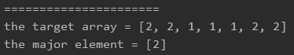

<!-- TOC -->

- [1. Easy Question: Majority Element](#1-easy-question-majority-element)
- [2. Solution](#2-solution)
  - [2.1. Approach 1: Hash Map](#21-approach-1-hash-map)
    - [2.1.1. Run Code Result](#211-run-code-result)
    - [2.1.2. Complexity Analysis](#212-complexity-analysis)
  - [2.2. Approach 2: Moore Vooting Algorithm](#22-approach-2-moore-vooting-algorithm)
    - [2.2.1. Complexity Analysis](#221-complexity-analysis)

<!-- /TOC -->

## 1. Easy Question: Majority Element  

Given an array of size n, find the majority element. The majority element is the element that appears **more than** `⌊ n/2 ⌋` times.

You may assume that the array is non-empty and the majority element always exist in the array.

**Example 1:**

>Input: [3,2,3]  
>Output: 3

**Example 2:**

>Input: [2,2,1,1,1,2,2]  
>Output: 2

## 2. Solution

### 2.1. Approach 1: Hash Map
- It's easy to deal with it with hash map.  
- We can regard the element as key, and the times of appearing as the value.  
- Therefore, we can use the hash map to store all the key-value pairs.  
- Then we can get the major element in the array as long as we get the max value in the map.
- So we can transfer the map's value to list and sort it.

```java
class Solution {
    public int majorityElement(int[] nums) {
        //get the counts of every element
        HashMap<Integer, Integer> map = new HashMap<Integer, Integer>();
        for (int i = 0; i < nums.length; i++) {
            if (map.containsKey(nums[i])) {
                map.put(nums[i], map.get(nums[i]) + 1);
            } else {
                map.put(nums[i], 1);
            }
        }

        List<Integer> val_list = new ArrayList<Integer>(map.values());
        val_list.sort(new Comparator<Integer>() {
            @Override
            public int compare(Integer v1, Integer v2) {
                return v1 - v2;
            }
        });

        //define the max value and key
        int maxVal = val_list.get(val_list.size() - 1);
        int maxKey = 0;

        //loop through the map tp find the key fo the maxVal
        for (Map.Entry<Integer, Integer> entry : map.entrySet()) {
            if (entry.getValue() == maxVal) {
                maxKey = entry.getKey();
            }
        }

        //return the majority element
        return maxKey;
    }
}
```

#### 2.1.1. Run Code Result  


#### 2.1.2. Complexity Analysis
- Time Complexity: O(n). Cuz we use only 2 single loops.
- Space Complexity: O(n). Cuz we use the hash map to store each element's info.

### 2.2. Approach 2: Moore Vooting Algorithm
- With this algorithm we can deal with this problem by only one loop.  
- By looping through the array, we can get the majority element.  
- It's easy to understand.  
- We can assume a element is the majority element and record it's appearing time.
- When the element is appearing, then the count add 1 or sub 1 still the count = 0.
- When the count = 0, we change the majority element to the current element, and keep looping.
- We will get the majority element when the loop is ended.

```java
class Solution {
   public int majorityElement(int[] nums) {
    int count=0, ret = 0;
    for (int num: nums) {
        if (count==0)
            ret = num;
        if (num!=ret)
            count--;
        else
            count++;
    }
    return ret;
   }
}
```

#### 2.2.1. Complexity Analysis
- Time Complexity: O(n).
- Space Complexity: O(1).