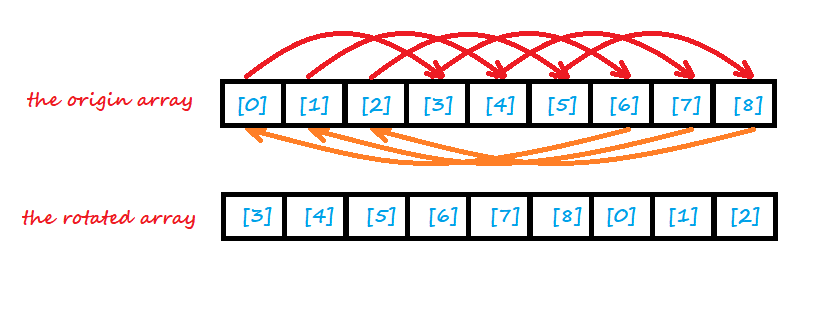
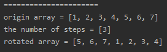
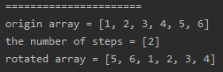

<!-- TOC -->

- [1. Easy Problem: Rotate Array](#1-easy-problem-rotate-array)
- [2. Solution](#2-solution)
  - [2.1. Approach 1: Replacement Pattern](#21-approach-1-replacement-pattern)
    - [2.1.1. The Code](#211-the-code)
    - [2.1.2. Run Code Result](#212-run-code-result)
    - [2.1.3. Complexity Analysis](#213-complexity-analysis)

<!-- /TOC -->

## 1. Easy Problem: Rotate Array
Given an array, rotate the array to the right by k steps, where k is non-negative.

**Follow up:**

- Try to come up as many solutions as you can, there are at least 3 different ways to solve this problem.
- Could you do it in-place with O(1) extra space?
 

**Example 1:**

>**Input:** nums = [1,2,3,4,5,6,7], k = 3  
>**Output:** [5,6,7,1,2,3,4]  
>**Explanation:**  
>rotate 1 steps to the right: [7,1,2,3,4,5,6]  
>rotate 2 steps to the right: [6,7,1,2,3,4,5]  
>rotate 3 steps to the right: [5,6,7,1,2,3,4]  

**Example 2:**  

>**Input:** nums = [-1,-100,3,99], k = 2  
>**Output:** [3,99,-1,-100]  
>**Explanation:**   
>rotate 1 steps to the right: [99,-1,-100,3]  
>rotate 2 steps to the right: [3,99,-1,-100]  
  

**Constraints:**

>- 1 <= nums.length <= 2 * 10^4
>- It's guaranteed that nums[i] fits in a 32 bit-signed integer.
>- k >= 0

## 2. Solution

### 2.1. Approach 1: Replacement Pattern
- We can find the pattern when the elements' indexes are changed.

- We can assume a integer array `nums[]` and a `index (0 <= index < nums.length`).  

- We can assign array's length to a variable `len = nums.length`.

- `k` is the number of the rotating steps also the number of the elements which are moved to the array's head from its tail.

- NOW if we want to changed the elements' indexes,  
  then we can find that `nums[(index + k) % len] = nums[index]`.  
    

- HOWEVER, we should pay attention to this situation `len % k == 0`.  
  When we increase the `index` by `index = (index + k) % len`,  
  we will find that the value of `index` will run into a loop,  
  the loop looks like that `index -> index + nk -> len -> index`.  

- THEREFORE, we should judge if the `index` runs into the loop,  
  when the `index` is rolled back to the origin value,  
  we shoud increase it by adding up with `1` and continue to edit array.  
  
- SO we can define a variable `count` to record the times of roll-back.  
  the initial value of count is `0` (it's also the initial value of index),  
  When `index == count` it proves that `index` is rolled back,  
  then we should make `count++` and `index=count`.  

- And we should look out for storing the element with temporary variable.  
  Before the `nums[(index + nk) % len]` is changed, we should store its value,  
  and this value can be used to assign `nums[(index + (n+1)k) % len]`.  

#### 2.1.1. The Code
```java
public void rotate(int[] nums, int k) {
    //when k==0 and nums.length == 1, we can jump out the function
    //cuz it's meaningless to move 0 element from array's tail to head or rotate the array with 1 element
    k %= nums.length;
    if (k == 0 || nums.length == 1) return;

    //get the length of array
    int len = nums.length;

    //the index of element in array
    int index = 0;

    //define 2 temporary variables to store element's val
    int temp1 = 0;
    int temp2 = nums[index];

    //record the time of index's roll-back
    int count = index;

    //start rotating and finish it when all the elements get the new value
    for (int i = 0; i < len; i++) {
        if (index != count) {
            temp2 = temp1;
        }

        //store the new value and assign last value to new element
        temp1 = nums[(index + k) % len];
        nums[(index + k) % len] = temp2;
        //step up to next element
        index = (index + k) % len;

        //increase the index when index is rolled back to origin value
        if (index == count) {
            count++;
            index = count;
            temp2 = nums[index];
        }
    }
}
```

#### 2.1.2. Run Code Result
- nums = [1,2,3,4,5,6,7], k = 3  
    

- nums = [1,2,3,4,5,6], k = 2  
    

#### 2.1.3. Complexity Analysis
- Time Complexity: O(n).
- Space Complexity: O(1).