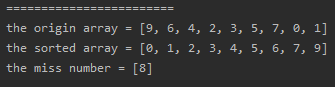
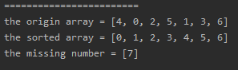

<!-- TOC -->

- [1. Easy Problem: Missing Number](#1-easy-problem-missing-number)
- [2. Solution](#2-solution)
  - [2.1. Approach 1: Sorting](#21-approach-1-sorting)
    - [2.1.1. The Code](#211-the-code)
    - [2.1.2. Run Code Result](#212-run-code-result)
    - [2.1.3. Complexi Analysis](#213-complexi-analysis)
  - [2.2. Approach 2: Get the Sum](#22-approach-2-get-the-sum)
    - [2.2.1. The Code](#221-the-code)
    - [2.2.2. Complexity Analysis](#222-complexity-analysis)

<!-- /TOC -->

## 1. Easy Problem: Missing Number
Given an array containing n distinct numbers taken from `0, 1, 2, ..., n`,  
find the one that is missing from the array.

**Example 1:**

>Input: [3,0,1]
>Output: 2

**Example 2:**

>Input: [9,6,4,2,3,5,7,0,1]
>Output: 8

## 2. Solution

### 2.1. Approach 1: Sorting
- We can sort the array and compare the value to its index.
- If an element's value isnt equaled to its index, proves that the missing number is its index.
- If all the values are matched all indexes, proves that the missing number is `n` (`n == nums.length`).

#### 2.1.1. The Code
```java
class Solution {
    public int missingNumber(int[] nums) {
        Arrays.sort(nums);
        for (int i = 0; i < nums.length; i++) {
            if (nums[i] != i)
                return i;
        }
        return nums.length;
    }
}
```

#### 2.1.2. Run Code Result  
- Situation 1:  
    

- Situation 2:  
  

#### 2.1.3. Complexi Analysis
- Time Complexity: O(nlog<sub>2</sub>n). Cuz we should sorted the array in this way.
- Space Complexity: O(1).

****

### 2.2. Approach 2: Get the Sum
- If there is no missing number, we can add up all the numbers from `0` to `n`.  
- We know the equation of the sum of the numbers from `0` to `n` is `(n+1)n/2`.
- Therefore, we can substract each element from the `sum`.
- Finally, the `sum` is equaled to the missing number.

#### 2.2.1. The Code
```java
class Solution {
    public int missingNumber(int[] nums) {
        int sum = nums.length * (nums.length + 1) / 2;
        for (int i = 0; i < nums.length; i++) {
            sum -= nums[i];
        }
        return sum;
    }
}
```

#### 2.2.2. Complexity Analysis
- Time Complexity: O(n).
- Space Complexity: O(1).