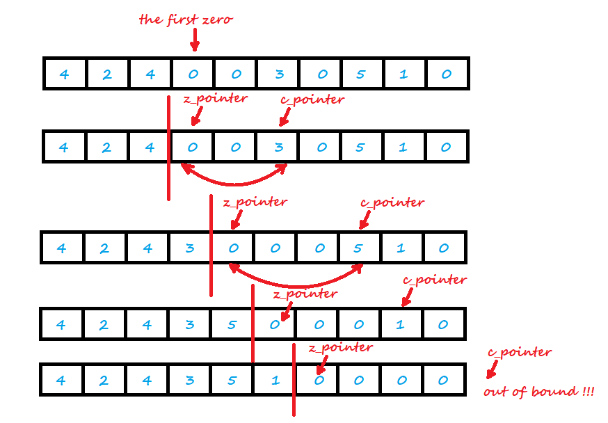
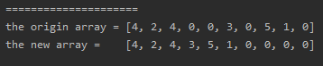

<!-- TOC -->

- [1. Easy Problem: Move Zeroes](#1-easy-problem-move-zeroes)
- [2. Solution](#2-solution)
  - [2.1. Approach 1: Find the first zero](#21-approach-1-find-the-first-zero)
    - [2.1.1. The Code](#211-the-code)
    - [2.1.2. Run Code Result](#212-run-code-result)

<!-- /TOC -->

## 1. Easy Problem: Move Zeroes
Given an array `nums`, write a function to move all `0`'s to the end of it while maintaining the relative order of the non-zero elements.

**Example:**  

>Input: [0,1,0,3,12]  
>Output: [1,3,12,0,0]  

**Note:**  

- You must do this in-place without making a copy of the array.
- Minimize the total number of operations.

## 2. Solution

### 2.1. Approach 1: Find the first zero
- Cuz we dont have to sorted the array, our target is changing all 0's position.  

- So we can find the position where the zero appears first time, and get the index.  

- We dont have to do anything to the element before `nums[index]`.  

- SO the starting point is `nums[index]`.
  
- Then we should exchange the positions of non-zero element and zero.  

- Define two pointers for exchanging the elements: 
  - z_pointer is pointing to the first zero element  
  (the first zero's position will be changed when elements are moved);
  - c_pointer is pointing to non-zero element.

- When the c_pointer is out of the array's bound, the function is ended.



#### 2.1.1. The Code
```java
class Solution {
    public void moveZeroes(int[] nums) {
        int z_point = 0;
        while (z_point < nums.length && nums[z_point] != 0) {
            z_point++;
        }
        if (z_point >= nums.length - 1) return;

        int c_point = z_point + 1;
        while (c_point < nums.length) {
            if (nums[c_point] != 0) {
                nums[z_point] = nums[c_point];
                nums[c_point] = 0;
                z_point++;
            }
            c_point++;
        }
    }
}
```

#### 2.1.2. Run Code Result
  