<!-- TOC -->

- [1. Medium Problem: Find the Duplicate Number](#1-medium-problem-find-the-duplicate-number)
- [2. Solution](#2-solution)
  - [2.1. Approach 1: Floyd's Tortoise and Hare (Cycle Detection)](#21-approach-1-floyds-tortoise-and-hare-cycle-detection)
    - [2.1.1. The Implementation](#211-the-implementation)
    - [2.1.2. The Code](#212-the-code)
    - [2.1.3. Complexity Analysis](#213-complexity-analysis)

<!-- /TOC -->

## 1. Medium Problem: Find the Duplicate Number
Given an array of integers nums containing `n + 1` integers where each integer is in the range `[1, n]` inclusive.

There is only one duplicate number in nums, return this duplicate number.

**Example 1:**
```
Input: nums = [1,3,4,2,2]
Output: 2
```

**Example 2:**
```
Input: nums = [3,1,3,4,2]
Output: 3
```

**Example 3:**
```
Input: nums = [1,1]
Output: 1
```

**Example 4:**
```
Input: nums = [1,1,2]
Output: 1
```

**Constraints:**

>- 2 <= n <= 3 * 10<sup>4</sup>  
>- nums.length == n + 1  
>- 1 <= nums[i] <= n  
>- All the integers in nums appear only once except for precisely one integer which appears two or more times.

## 2. Solution

### 2.1. Approach 1: Floyd's Tortoise and Hare (Cycle Detection)
- First of all, where does the cycle come from?  
  Let's use the function `f(x) = nums[x]` to construct the sequence:  
  `x, nums[x], nums[nums[x]], nums[nums[nums[x]]], ...`
- Each new element in the sequence is an element in nums at the index of the previous element.
- If one starts from `x = nums[0]`, such a sequence will produce a linked list with a cycle.

> The cycle appears because `nums` contains duplicates. The duplicate node is a cycle entrance.

- Here is how it works:  
  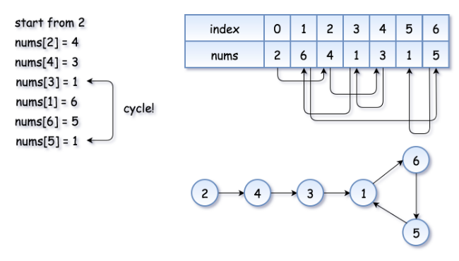

- The example above is simple because the loop is small.  
  Here is a more interesting example:  
  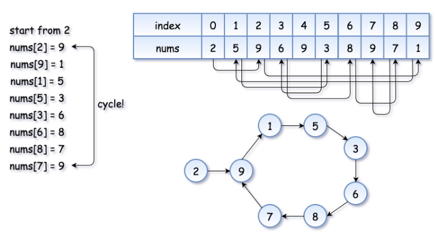

- Now the problem is to find the entrance of the cycle. 
  
**Algorithm**  
Floyd's algorithm consists of two phases and uses two pointers,  usually called `tortoise` and `hare`.  

**In phase 1**, `hare = nums[nums[hare]]` is twice as fast as `tortoise = nums[tortoise]`.  
- Since the hare goes fast, it would be the first one who enters the cycle and starts to run around the cycle.  
- At some point, the tortoise enters the cycle as well, and since it's moving slower the hare catches the tortoise up at some intersection point.  
- Now phase 1 is over, and the tortoise has lost. 

> Note that the intersection point is not the cycle entrance in the general case.  

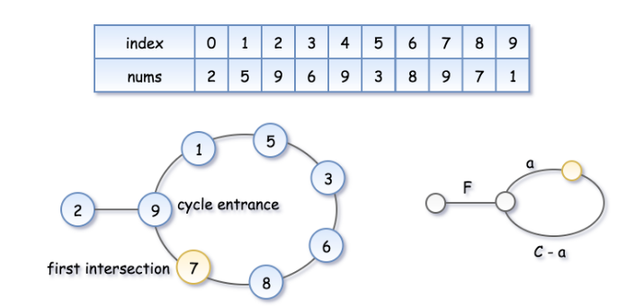  

- To compute the intersection point, let's note that  
  the hare has traversed twice as many nodes as the tortoise, i.e.  
  ```
  2d(tortoise) = d(hare), that means 

  2(F + a) = F + nC + a, where n is some integer.
  ```

> Hence the coordinate of the intersection point is `F + a = nC`.  

**In phase 2**, we give the tortoise a second chance by slowing down the hare, so that  
it now moves with the speed of tortoise: `tortoise = nums[tortoise], hare = nums[hare]`.  
The tortoise is back at the starting position, and the hare starts from intersection point.  
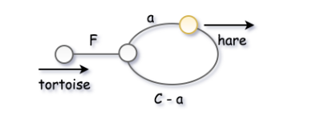  

Let's show that this time they meet at the cycle entrance after `F` steps.  
- The tortoise started from zero, so its position after `F` steps is `F`.

- The hare started at the intersection point `F + a = nC`,  
  so its position after `F` steps is `nC + F`, that is the same point as `F`.

- So the tortoise and the (slowed down) hare will meet at the entrance of the cycle.

#### 2.1.1. The Implementation
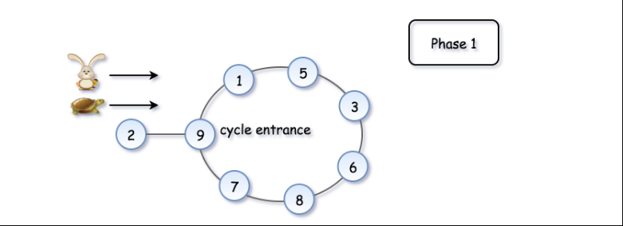  
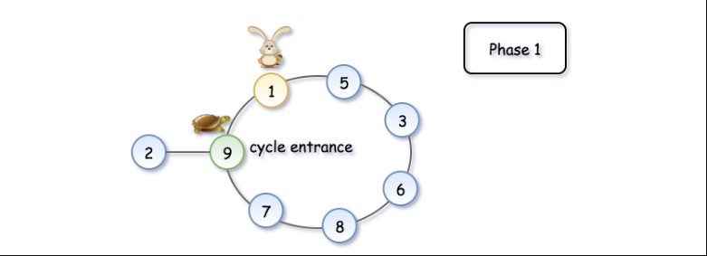  
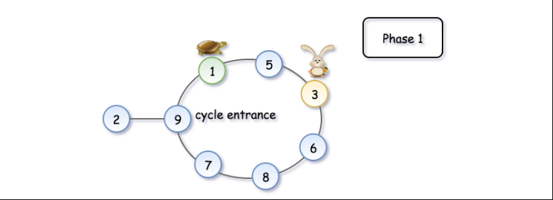  
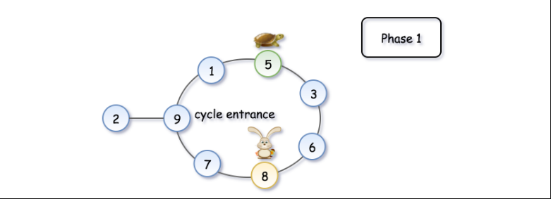  
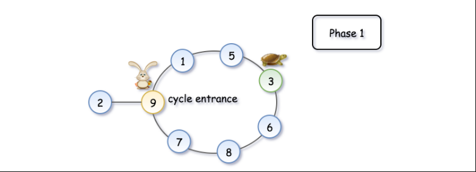  
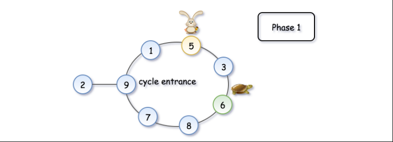  
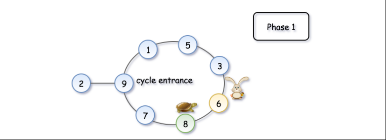  
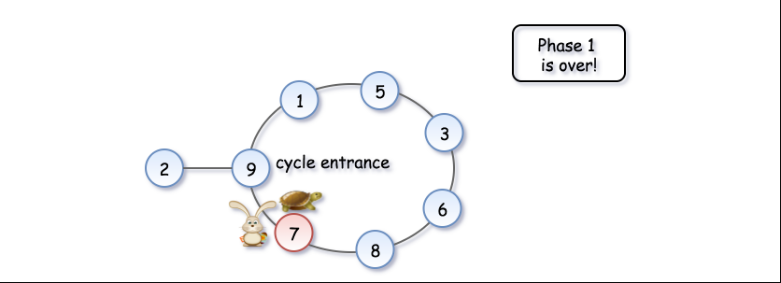  
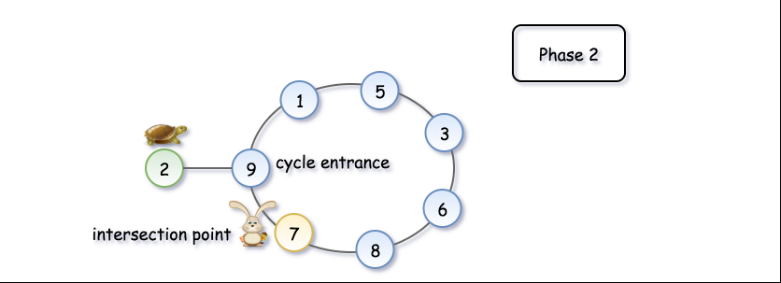  
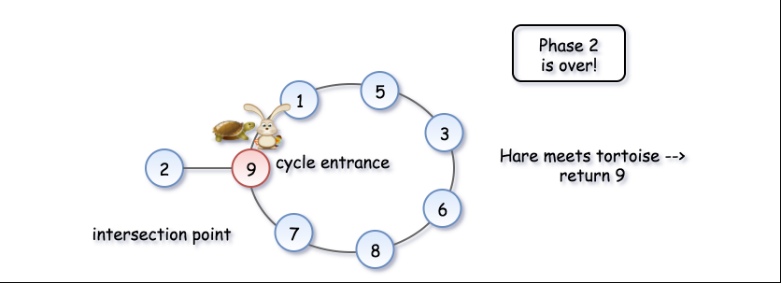

#### 2.1.2. The Code
```java
class Solution {
  public int findDuplicate(int[] nums) {
    // Find the intersection point of the two runners.
    int tortoise = nums[0];
    int hare = nums[0];
    do {
      tortoise = nums[tortoise];
      hare = nums[nums[hare]];
    } while (tortoise != hare);

    // Find the "entrance" to the cycle.
    tortoise = nums[0];
    while (tortoise != hare) {
      tortoise = nums[tortoise];
      hare = nums[hare];
    }

    return hare;
  }
}
```

#### 2.1.3. Complexity Analysis
- Time Complexity: O(n)
- Space Complexity: O(1)