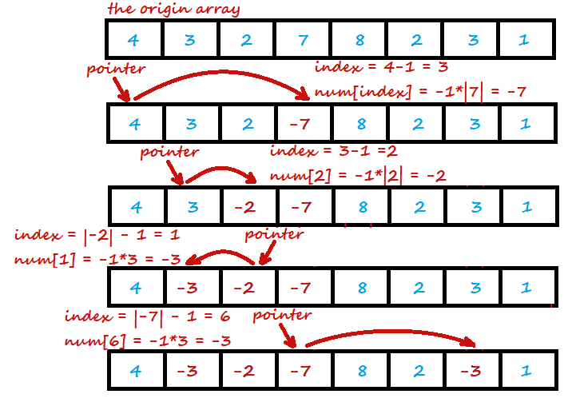
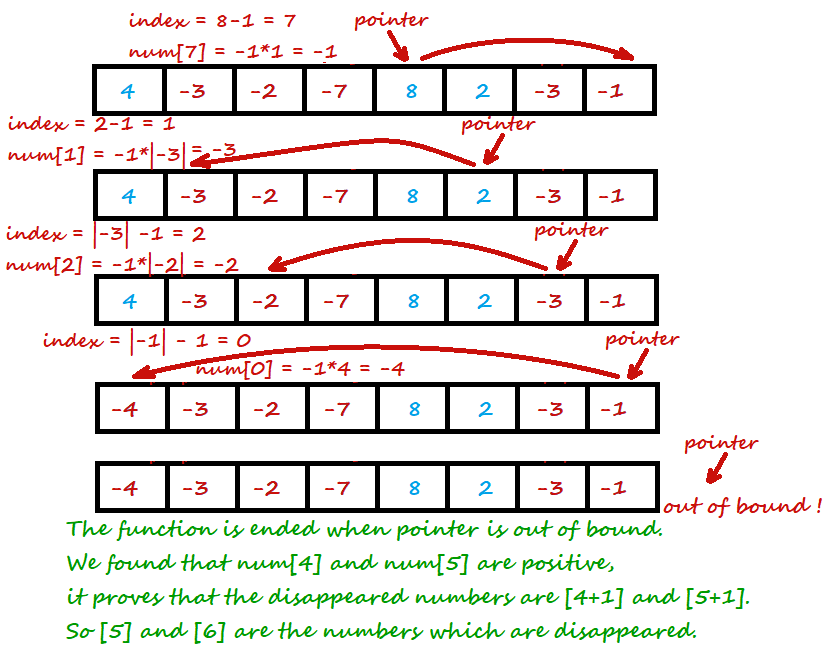
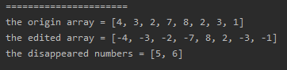

<!-- TOC -->

- [1. Easy Problem: Find All Numbers Disappeared in an Array](#1-easy-problem-find-all-numbers-disappeared-in-an-array)
- [2. Solution](#2-solution)
  - [2.1. Approach 1: Use the elements' value as index](#21-approach-1-use-the-elements-value-as-index)
    - [2.1.1. Diagrammatize](#211-diagrammatize)
    - [2.1.2. The Code](#212-the-code)
    - [2.1.3. Run Code Result](#213-run-code-result)
    - [2.1.4. Complexity Analysis](#214-complexity-analysis)

<!-- /TOC -->

## 1. Easy Problem: Find All Numbers Disappeared in an Array
Given an array of integers where` 1 <= a[i] <= n` (n = size of array),  
some elements appear twice and others appear once.

Find all the elements of `[1, n]` inclusive that do not appear in this array.

Could you do it without extra space and in O(n) runtime?  
You may assume the returned list does not count as extra space.

**Example:**

>Input:  
>[4,3,2,7,8,2,3,1]
>  
>Output:  
>[5,6]

## 2. Solution

### 2.1. Approach 1: Use the elements' value as index
- We get the array nums[] and it's length is n.

- Cuz all the elements in array are less than or equal to array's length.  

- So the `element - 1` can be the index to find next element.

- If there is no number disappeared in the array and the array is sorted,  
  then we can find the array like `[1, 2, 3, ..., n-1, n]`,  
  and `nums[index] = index + 1 = element` (`0 <= index < n`).

- So we can use the current element -1 as an index to flag `nums[index]`.  
  Make `nums[index]` negative as a sign of existance of `number = index + 1`.

- Finally we can get the new array with some negative elements.  
  And the non-negative element's index + 1 is the disappeared number.  

- **Cautions:**  
  - The index should not be out of bound so `index = element - 1`.  
  - The element may be negative, we have to make it positive before use it as index.  
    Therefore the `index = Math.abs(element) - 1`.  
  - The index may also be dupliacte and we should make sure the element of  occured index is neagtive so that the `element = -1 * Math.abs(element)`.

****

#### 2.1.1. Diagrammatize



#### 2.1.2. The Code
```java
class Solution {
    public List<Integer> findDisappearedNumbers(int[] nums) {
        List<Integer> resList = new ArrayList<Integer>();
        int index;
        for (int i = 0; i < nums.length; i++) {
            index = Math.abs(nums[i]) - 1;
            nums[index] = Math.abs(nums[index]) * -1;
        }

        for (int i = 0; i < nums.length; i++) {
            if (nums[i] > 0) {
                resList.add(i + 1);
            }
        }

        return resList;
    }
}
```

#### 2.1.3. Run Code Result


#### 2.1.4. Complexity Analysis
- Time Complexity: O(n).
- Space Complexity: O(1).