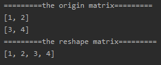

<!-- TOC -->

- [1. Easy Problem: Reshape the Matrix](#1-easy-problem-reshape-the-matrix)
- [2. Solution](#2-solution)
  - [2.1. Approach 1: Division and modulus](#21-approach-1-division-and-modulus)
    - [2.1.1. The Code](#211-the-code)
    - [2.1.2. Run Code Result](#212-run-code-result)
    - [2.1.3. Complexity Analysis](#213-complexity-analysis)

<!-- /TOC -->

## 1. Easy Problem: Reshape the Matrix
In MATLAB, there is a very useful function called 'reshape', which can reshape a matrix into a new one with different size but keep its original data.

You're given a matrix represented by a two-dimensional array, and two **positive** integers **r** and **c** representing the **row** number and **column** number of the wanted reshaped matrix, respectively.

The reshaped matrix need to be filled with all the elements of the original matrix in the same **row-traversing** order as they were.

If the 'reshape' operation with given parameters is possible and legal, output the new reshaped matrix; Otherwise, output the original matrix.

**Example 1:**  
>Input:   
nums =   
[[1,2],  
 [3,4]]  
r = 1, c = 4  
>Output:   
[[1,2,3,4]]  
>Explanation:  
The row-traversing of nums is [1,2,3,4]. The new reshaped matrix is a 1 * 4 matrix, fill it row by row by using the previous list.   

**Example 2:**  
>Input:   
nums =   
[[1,2],  
 [3,4]]  
>r = 2, c = 4  
>Output:   
[[1,2],  
 [3,4]]  
>Explanation:  
There is no way to reshape a 2 * 2 matrix to a 2 * 4 matrix. So output the original matrix.

**Note:**  
1. The height and width of the given matrix is in range [1, 100].  
2. The given r and c are all positive.  

## 2. Solution

### 2.1. Approach 1: Division and modulus
- Firstly, we should get the numbers of array's `row` and `column`.

- We can assume there is a 1-D array with length equal to `row * column`.  

- This 1-D array includes all the elements of the 2-D array.

- Now we can find some rules between 1-D array and 2-D array.
  - We use variable `index` as the index of the elements in 1-D array.  
  - The `index` is more than and equal to 0 and less than `row * column`.
  - Then we can find the rule like that  
  `1-D-ARRAY[index] = 2-D-ARRAY[index / column][index % column]`

- This rule is also same to the new matrix, the column of it is `col`,  
  `1-D-ARRAY[index] = NEW-MATRIX[index / col][index % col]`   

- THEREFORE we can get the result of reshaping  
`NEW-MATRIX[index / col][index % col] = `  
`2-D-ARRAY[index / column][index % column]`  

#### 2.1.1. The Code
```java
class Solution {
    public int[][] matrixReshape(int[][] nums, int r, int c) {
        int n_col = nums[0].length;

        if (nums.length * n_col != r * c) return nums;

        int[][] res = new int[r][c];

        for (int i = 0; i < r * c; i++) {
            res[i / c][i % c] = nums[i / n_col][i % n_col];
        }

        return res;
    }
}
```

#### 2.1.2. Run Code Result


#### 2.1.3. Complexity Analysis
- Time Complexity: O(r*c). We should get all the elements in 2-D array.
- Space Complexity: O(r*c). We must define a new 2-D array to store elements.