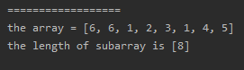

## Easy Problem: Shortest Unsorted Continuous Subarray  
Given an integer array, you need to find one **continuous subarray** that if you only sort this subarray in ascending order, then the whole array will be sorted in ascending order, too.

You need to find the **shortest** such subarray and output its length.

**Example 1:**  
>Input: [2, 6, 4, 8, 10, 9, 15]  
>Output: 5  
>Explanation: You need to sort [6, 4, 8, 10, 9] in ascending order to make the whole array sorted in ascending order.  

**Note:**  
1. Then length of the input array is in range [1, 10,000].  
2. The input array may contain duplicates, so ascending order here means <=.  

## Solution
### Approach 1: Using Sorting
- It's easy to understand.
- Sort and compare with the origin array find out the subarray.

#### The Code
```java
class Solution {
    public int findUnsortedSubarray(int[] nums) {
        int[] sorted_nums = Arrays.copyOf(nums, nums.length);
        Arrays.sort(sorted_nums);
        int head = -1;
        int tail = -1;
        for (int i = 0; i < nums.length; i++) {
            if (head == -1) {
                if (sorted_nums[i] != nums[i]) {
                    head = i;
                }
            }

            if (tail == -1) {
                if (sorted_nums[nums.length - 1 - i] != nums[nums.length - 1 - i]) {
                    tail = nums.length - 1 - i;
                }
            }
            if (tail != -1 && head != -1) break;
        }

        if (head == tail) return 0;
        return tail - head + 1;
    }
}
```

#### Run Code Result


#### Complexity Analysis
- Time Complexity: O(nlogn).
- Space Complexity: O(n).
