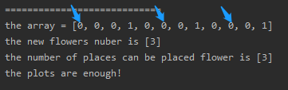
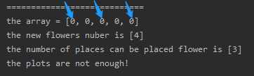

<!-- TOC -->

- [1. Easy Problem: Can Place Flowers](#1-easy-problem-can-place-flowers)
- [2. Solution](#2-solution)
  - [2.1. Approach 1: Devide The Array (Origin Array WONT be changed)](#21-approach-1-devide-the-array-origin-array-wont-be-changed)
    - [2.1.1. The Code](#211-the-code)
    - [2.1.2. Run Code Result](#212-run-code-result)
    - [2.1.3. Complexity Analysis](#213-complexity-analysis)
  - [2.2. Approach 2: Single Scan (Origin Array Changed)](#22-approach-2-single-scan-origin-array-changed)
    - [2.2.1. The Code](#221-the-code)
    - [2.2.2. Complexity Analysis](#222-complexity-analysis)

<!-- /TOC -->

## 1. Easy Problem: Can Place Flowers
Suppose you have a long flowerbed in which some of the plots are planted and some are not.  
However, flowers cannot be planted in adjacent plots - they would compete for water and both would die.

Given a flowerbed (represented as an array containing 0 and 1, where 0 means empty and 1 means not empty),  
and a number **n**, return if **n** new flowers can be planted in it without violating the no-adjacent-flowers rule.

**Example 1**:  
>Input: flowerbed = [1,0,0,0,1], n = 1  
>Output: True  

**Example 2**:  
>Input: flowerbed = [1,0,0,0,1], n = 2  
>Output: False  

**Note**:  
1. The input array won't violate no-adjacent-flowers rule.  
2. The input array size is in the range of [1, 20000].  
3. **n** is a non-negative integer which won't exceed the input array size.

## 2. Solution

### 2.1. Approach 1: Devide The Array (Origin Array WONT be changed)
If there is an array like [0,0,0,1,0,0,0,1,0,0,0] or [0,0,0,0,0,0].  

We can devide the array to several parts according to the conditions.

Before we devide the array we define `count` as the number of zero.

There is 4 situation when we devide the array:  
1. [0,0,0,0,0] in this situation, the number of plots is `count / 2 + 1`;
2. [0,0,0,0,1] in this situation, the number of plots is `count/2`;
3. [1,0,0,0,1] in this situation, the number of plots is `count/2`.
4. [1,0,0,0,0] in this situation, the number of plots is also `count/2`;

And we should make sure that the `count` is odd number in situation 1 & 3:  
`count = count % 2 == 0 ? count - 1 : count;`

Dont forget to reset the `count` to zero when finish the judgement.


#### 2.1.1. The Code
```java
class Solution {
    public boolean canPlaceFlowers(int[] flowerbed, int n) {
        int count = 0;
        int place = 0;
        int sign;

        for (sign = 0; sign < flowerbed.length; sign++) {
            if (flowerbed[sign] == 0) {
                count++;
            } else {
                break;
            }
        }

        if (count != 0) {
            if (count == flowerbed.length) {
                count = count % 2 == 0 ? count - 1 : count;
                place = count / 2 + 1;
            } else {
                place += count / 2;
            }
            count = 0;
        }

        for (int i = sign; i < flowerbed.length; i++) {
            if (flowerbed[i] == 0) {
                count++;
            } else {
                if (count != 0) {
                    count = count % 2 == 0 ? count - 1 : count;
                    place += count / 2;
                    count = 0;
                }
            }
        }

        if (count != 0) {
            place += count / 2;
        }

        return place >= n;
    }
}
```

#### 2.1.2. Run Code Result
- Example 1:  
  

- Example 2:  
  

#### 2.1.3. Complexity Analysis
- Time Complexity: O(n).
- Space Complexity: O(1).

****

### 2.2. Approach 2: Single Scan (Origin Array Changed)
- We can find out the extra maximum number of flowers, **count**, that can be planted for the given **flowerbed** arrangement.  

- To do so, we can traverse over all the elements of the **flowerbed** and find out those elements which are 0(implying an empty position).  

- For every such element, we check if its both adjacent positions are also empty.  

- If so, we can plant a flower at the current position without violating the no-adjacent-flowers-rule(This operation will change the origin array).  

- For the first and last elements, we need not check the previous and the   next adjacent positions respectively.  

- If the **count** obtained is greater than or equal to **n**, the required number of flowers to be planted, we can plant **n** flowers in the empty spaces, otherwise not.

#### 2.2.1. The Code
```java
public class Solution {
    public boolean canPlaceFlowers(int[] flowerbed, int n) {
        int i = 0, count = 0;
        while (i < flowerbed.length) {
            if (flowerbed[i] == 0 && (i == 0 || flowerbed[i - 1] == 0) && (i == flowerbed.length - 1 || flowerbed[i + 1] == 0)) {
                flowerbed[i] = 1;
                count++;
            }
            i++;
        }
        return count >= n;
    }
}
```

#### 2.2.2. Complexity Analysis
- Time Complexity: O(n).
- Space Complexity: O(1).