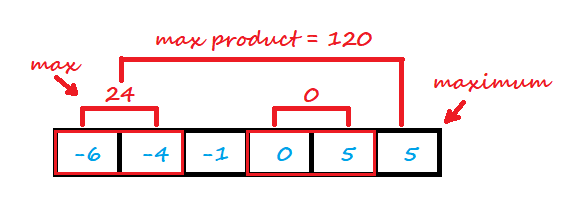
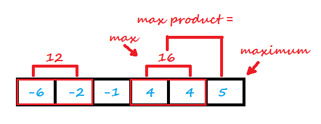

<!-- TOC -->

- [1. Easy Problem: Maximum Product of Three Numbers](#1-easy-problem-maximum-product-of-three-numbers)
- [2. Solution](#2-solution)
  - [2.1. Approach 1: Using Sorting](#21-approach-1-using-sorting)
    - [2.1.1. The Diagram](#211-the-diagram)
    - [2.1.2. The Code](#212-the-code)
    - [2.1.3. Complexity Analysis](#213-complexity-analysis)
  - [2.2. Approach 2: Single Loop](#22-approach-2-single-loop)
    - [2.2.1. The Code](#221-the-code)
    - [2.2.2. Complexity Analysis](#222-complexity-analysis)

<!-- /TOC -->

## 1. Easy Problem: Maximum Product of Three Numbers
Given an integer array, find three numbers whose product is maximum and output the maximum product.

**Example 1:**  

>Input: [1,2,3]  
>Output: 6
 

**Example 2:**  

>Input: [1,2,3,4]  
>Output: 24
 

**Note:**  

1. The length of the given array will be in range [3,104] and all elements are in the range [-1000, 1000].
2. Multiplication of any three numbers in the input won't exceed the range of 32-bit signed integer.

## 2. Solution

### 2.1. Approach 1: Using Sorting
- We can sort the array firstly, and get the ascending array.  

- If all the elements in array are positives, the product of  
  the 3rd to 1st maximum numbers is the max product.  
  So we can return it as the result.

- If there are some negative elements in array we should get  
  the product of the 1st and 2nd minimum negative elements in array.  
  And compare it with the product of the 3rd and 2nd maximum numbers.  
  Get the maximum product and return the product of it and the maximum number.

- **NOTES**:  
  - The maximum nuber is the one must be multiplied cuz is the maximum.

  - What we should make sure is to get the max product of 2th and 3rd numbers.
  
  - Two negative elements should be choosed if we need negative elements.  
    Cuz the product should be positive to make sure the result is maximum.
  
  - Therefore what we should make a comparision between is ONLY  
    the product of the 1st and 2nd minimum negative elements  
    and the product of the 3rd and 2nd maximum numbers.

#### 2.1.1. The Diagram
- Example 1:  
  

- Example 2:  


#### 2.1.2. The Code
```java
class Solution {
    public int maximumProduct(int[] nums) {
        Arrays.sort(nums);
        int len = nums.length;

        int p_neg = nums[0] * nums[1];
        int p_pos = nums[len - 3] * nums[len - 2];

        if (p_neg >= p_pos) {
            return p_neg * nums[len - 1];
        } else {
            return p_pos * nums[len - 1];
        }
    }
}
```

#### 2.1.3. Complexity Analysis
- Time Complexity: O(nlogn). Sorting take O(nlogn) time.
- Space Complexity: O(logn). Sorting take O(logn) Space.


### 2.2. Approach 2: Single Loop
- We need not necessarily sort the given numsnums array to get the answer.

- If you comprehend the approach 1, there're only 5 elements we have to get.  

- We can only find the required 2 smallest values(`min1` and `min2`)  
and the three largest values(`max1`, `max2`, `max3`) in the `nums` array,  
by iterating over the `nums` array only once.

- Finally, we can find out the larger value out of `min1 * min2 * max1`  
and `max1× * max2 * ×max3` to find the required maximum product.  

#### 2.2.1. The Code
- Copy from leetcode solution

```java
public class Solution {
    public int maximumProduct(int[] nums) {
        int min1 = Integer.MAX_VALUE, min2 = Integer.MAX_VALUE;
        int max1 = Integer.MIN_VALUE, max2 = Integer.MIN_VALUE, max3 = Integer.MIN_VALUE;
        for (int n: nums) {
            if (n <= min1) {
                min2 = min1;
                min1 = n;
            } else if (n <= min2) {     // n lies between min1 and min2
                min2 = n;
            }
            if (n >= max1) {            // n is greater than max1, max2 and max3
                max3 = max2;
                max2 = max1;
                max1 = n;
            } else if (n >= max2) {     // n lies betweeen max1 and max2
                max3 = max2;
                max2 = n;
            } else if (n >= max3) {     // n lies betwen max2 and max3
                max3 = n;
            }
        }
        return Math.max(min1 * min2 * max1, max1 * max2 * max3);
    }
}
```

#### 2.2.2. Complexity Analysis
- Time Complexity: O(n).
- Space Complexity: O(1).