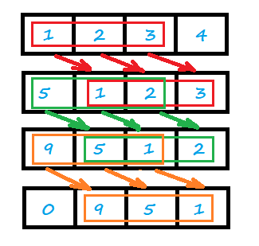

<!-- TOC -->

- [1. Easy Problem: Toeplitz Matrix](#1-easy-problem-toeplitz-matrix)
- [2. Solution](#2-solution)
  - [2.1. Approach 1: Brute Force](#21-approach-1-brute-force)
    - [2.1.1. The Diagram](#211-the-diagram)
    - [2.1.2. The Code](#212-the-code)
    - [2.1.3. Complexity Analysis](#213-complexity-analysis)

<!-- /TOC -->

## 1. Easy Problem: Toeplitz Matrix
A matrix is Toeplitz if every diagonal from top-left to bottom-right has the same element.  

Now given an M x N matrix, return True if and only if the matrix is Toeplitz.
 

**Example 1:**

>**Input:**  
matrix = [  
  [1,2,3,4],  
  [5,1,2,3],  
  [9,5,1,2]  
]  
>**Output:** True  
>**Explanation:**  
In the above grid, the diagonals are:  
"[9]", "[5, 5]", "[1, 1, 1]", "[2, 2, 2]", "[3, 3]", "[4]".  
In each diagonal all elements are the same, so the answer is True.  

**Example 2:**

>**Input:**  
matrix = [  
  [1,2],  
  [2,2]  
]  
>**Output:** False  
>**Explanation:**  
The diagonal "[1, 2]" has different elements.

**Note:**

1. matrix will be a 2D array of integers.  
2. matrix will have a number of rows and columns in range [1, 20].  
3. matrix[i][j] will be integers in range [0, 99].

## 2. Solution

### 2.1. Approach 1: Brute Force
- The top-right element and the bottom-left one are useless.
- Compare the current row's elements from `index = [0, length-2]`  
  with the next row's elements from `index = [1, length-1]`  
  
- Judge these elements if they are equaled.
  - True. The matrix is Toeplitz Matrix;
  - False. The matrix is not Toeplitz Matrix.

- The index of row can't be out of the bound.
- If there is only one row in matrix, return true.

#### 2.1.1. The Diagram
- Different pointers and square for each round of compare.  
- Obviously, the top-right element and the bottom-left one are useless.  
  They dont need to compare with others cuz they are the head and tail.  



#### 2.1.2. The Code
```java
class Solution {
    public boolean isToeplitzMatrix(int[][] matrix) {
        for (int row = 1; row < matrix.length; row++) {
            for (int col = 1; col < matrix[0].length; col++) {
                if (matrix[row - 1][col - 1] != matrix[row][col]) return false;
            }
        }
        return true;
    }
}
```

#### 2.1.3. Complexity Analysis
- Time Complexity: O(M*(N-1)) ≈ O(M*N).
- Space Complexity: O(1).