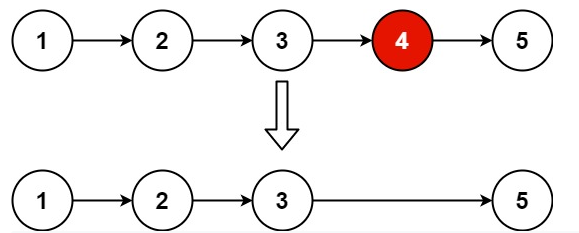
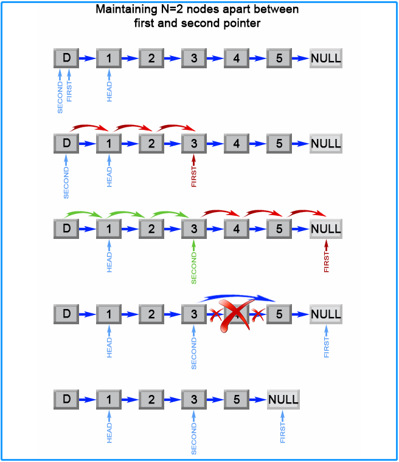

<!-- TOC -->

- [1. Medium Problrm: Remove Nth Node From End of List](#1-medium-problrm-remove-nth-node-from-end-of-list)
- [2. Solution](#2-solution)
  - [2.1. Approach 1: One pass algorithm](#21-approach-1-one-pass-algorithm)
    - [2.1.1. The Code](#211-the-code)
    - [2.1.2. Complexity Analysis](#212-complexity-analysis)

<!-- /TOC -->

## 1. Medium Problrm: Remove Nth Node From End of List
Given the `head` of a linked list, remove the n<sup>th</sup> node from the end of the list and return its head.  

**Finish in one pass.**

**Example 1:**  
  
```
Input: head = [1,2,3,4,5], n = 2
Output: [1,2,3,5]
```
**Example 2:**  
```
Input: head = [1], n = 1
Output: []
```
**Example 3:**  
```
Input: head = [1,2], n = 1
Output: [1]
```

**Constraints:**  

>- The number of nodes in the list is `sz`.  
>- `1 <= sz <= 30`  
>- `0 <= Node.val <= 100`  
>- `1 <= n <= sz`  

## 2. Solution
- Here is only the one-pass solution.

### 2.1. Approach 1: One pass algorithm
The above algorithm could be optimized to one pass. We could use two pointers. 
- The first pointer advances the list by `n+1` steps from the beginning. 
- The second pointer starts from the beginning of the list.   
  
Now, both pointers are exactly separated by `n` nodes apart.  

We maintain this constant gap by advancing both pointers together until the first pointer arrives past the last node.  
The second pointer will be pointing at the n<sup>th</sup> node counting from the last. 

We relink the next pointer of the node referenced by the second pointer to point to the node's next next node.  

  

#### 2.1.1. The Code
```java
public ListNode removeNthFromEnd(ListNode head, int n) {
    ListNode dummy = new ListNode(0);
    dummy.next = head;
    ListNode first = dummy;
    ListNode second = dummy;
    // Advances first pointer so that the gap between first and second is n nodes apart
    for (int i = 1; i <= n + 1; i++) {
        first = first.next;
    }
    // Move first to the end, maintaining the gap
    while (first != null) {
        first = first.next;
        second = second.next;
    }
    second.next = second.next.next;
    return dummy.next;
}
```

#### 2.1.2. Complexity Analysis
- Time Complexity: O(N);
- Space Complexity: O(1).