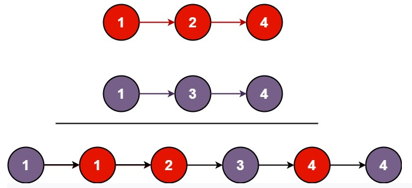
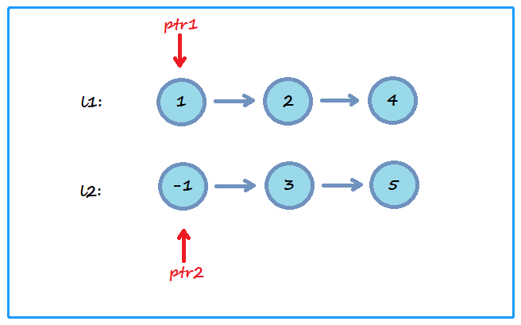
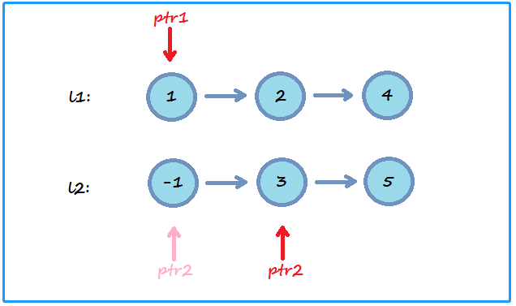
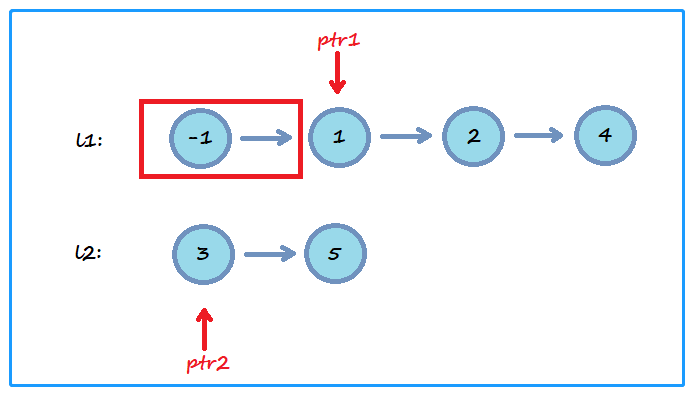
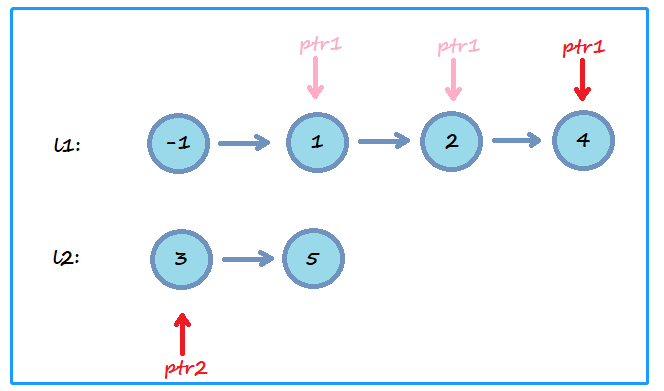
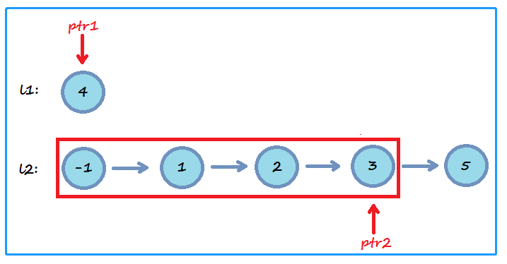
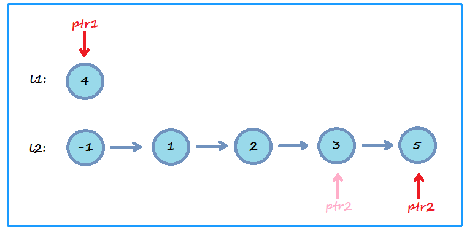
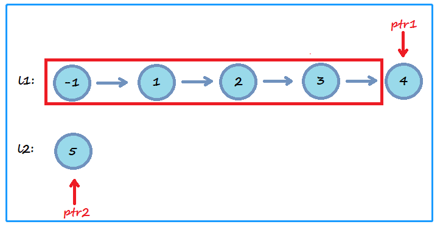
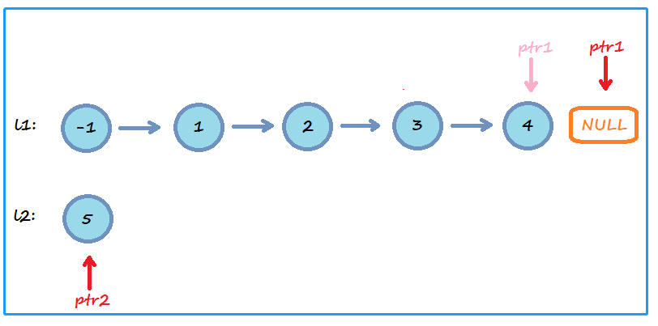
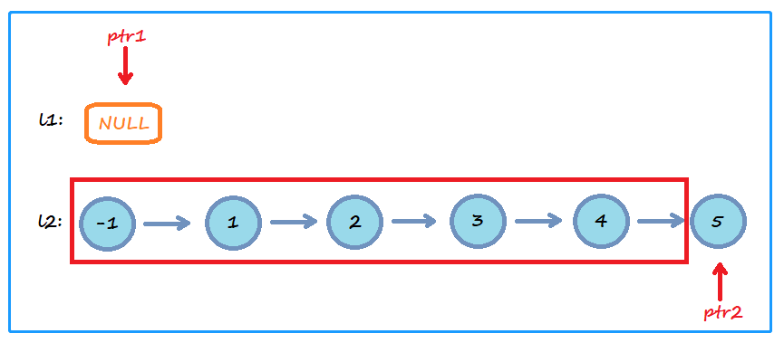

<!-- TOC -->

- [1. Easy Problem: Merge Two Sorted Lists](#1-easy-problem-merge-two-sorted-lists)
- [2. Solution](#2-solution)
  - [2.1. Approach 1: Two Pointers](#21-approach-1-two-pointers)
    - [2.1.1. The Code](#211-the-code)
    - [2.1.2. Complexity Analysis](#212-complexity-analysis)

<!-- /TOC -->

## 1. Easy Problem: Merge Two Sorted Lists
Merge two sorted linked lists and return it as a new **sorted** list.  
The new list should be made by splicing together the nodes of the first two lists.  

**Example 1:**  
  

```java
Input: l1 = [1,2,4], l2 = [1,3,4]
Output: [1,1,2,3,4,4]
```

**Example 2:**  
```java
Input: l1 = [], l2 = []
Output: []
```

**Example 3:**  
```java
Input: l1 = [], l2 = [0]
Output: [0]
```

**Constraints:**  

>- The number of nodes in both lists is in the range `[0, 50]`.  
>- `-100 <= Node.val <= 100`  
>- Both `l1` and `l2` are sorted in **non-decreasing** order.  

## 2. Solution

### 2.1. Approach 1: Two Pointers
- We can use two pointers to slove this problem.
- Define 2 pointers one pointed to the point in list1 another pointed to list2.  
  

- Compare the value of two pointers, if one is less or equaled to another,  
  then push the less one to next position till its value is larger than another  
  or itself becomes null.  
  

- Then make the points before the pushed point linked to another pointer.
  

- Loop these steps till one pointer becomes null.
    
    
    
    
    
  

- Finally we should return the head point of the new list.  
  We can get the head point from the heads of list1 and list2,  
  let the smaller one to be the new list head.  

#### 2.1.1. The Code
```java
/**
 * Definition for singly-linked list.
 * public class ListNode {
 *     int val;
 *     ListNode next;
 *     ListNode() {}
 *     ListNode(int val) { this.val = val; }
 *     ListNode(int val, ListNode next) { this.val = val; this.next = next; }
 * }
 */
class Solution {
    public ListNode mergeTwoLists(ListNode l1, ListNode l2) {
        //situation for one or two list is null
        if (l1 == null && l2 == null) return null;
        if (l1 == null) return l2;
        if (l2 == null) return l1;

        //define and init the pointers and temp var
        ListNode ptr1, ptr2, temp;
        ptr1 = l1;
        ptr2 = l2;
        temp = null;

        //when one pointer is pointed out of the list's bound we should end the loop
        while (ptr1 != null && ptr2 != null) {
            //get the point from list2 which can be linked to the ptr1 if that's all right
            while (ptr2 != null && ptr1.val >= ptr2.val) {
                temp = ptr2;
                ptr2 = ptr2.next;
            }
            //if temp is not null prove that the loop has been run 
            //we should change the link of the point pointed by temp
            if (temp != null && temp.val <= ptr1.val) {
                temp.next = ptr1;
                //reset
                temp = null;
            }

            //if ptr2 is null prove that all the points from list2 have been linked to list1's points
            if (ptr2 == null) break;

            while (ptr1 != null && ptr2.val >= ptr1.val) {
                temp = ptr1;
                ptr1 = ptr1.next;
            }
            if (temp != null && temp.val <= ptr2.val) {
                temp.next = ptr2;
                temp = null;
            }
        }

        //return the new list's head
        return l1.val >= l2.val ? l2 : l1;
    }
}
```

#### 2.1.2. Complexity Analysis
- Time Complexity: O(n).
- Space Complexity: O(1).