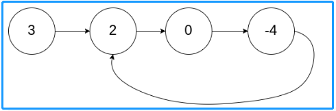
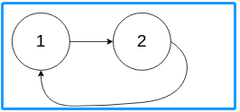
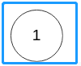

<!-- TOC -->

- [1. Medium Problem: Linked List Cycle II](#1-medium-problem-linked-list-cycle-ii)
- [2. Solution](#2-solution)
  - [2.1. Approach 1: Floyd's Cycle Detection](#21-approach-1-floyds-cycle-detection)
    - [2.1.1. The Code](#211-the-code)

<!-- /TOC -->

## 1. Medium Problem: Linked List Cycle II
Given a linked list, return the node where the cycle begins. If there is no cycle, return null.

There is a cycle in a linked list if there is some node in the list that can be reached again by continuously following the next pointer.  
Internally, pos is used to denote the index of the node that tail's next pointer is connected to.  
**Note that** `pos` **is not passed as a parameter.**

**Notice** that you **should not modify** the linked list.  

**Example 1:**  
  
```java
Input: head = [3,2,0,-4], pos = 1
Output: tail connects to node index 1
Explanation: There is a cycle in the linked list, where tail connects to the second node.
```

**Example 2:**  
  
```java
Input: head = [1,2], pos = 0
Output: tail connects to node index 0
Explanation: There is a cycle in the linked list, where tail connects to the first node.
```

**Example 3:**  
  
```java
Input: head = [1], pos = -1
Output: no cycle
Explanation: There is no cycle in the linked list.
```

**Constraints:**  
>- The number of the nodes in the list is in the range [0, 10<sup>4</sup>].
>- -10<sup>5</sup> <= Node.val <= 10<sup>5</sup>
>- pos is -1 or a **valid index** in the linked-list.

## 2. Solution

### 2.1. Approach 1: Floyd's Cycle Detection
It's same as this problem:
<a href="01.array\0287.Find The Duplicate Number.md">Find The Duplicate Number</a>

#### 2.1.1. The Code
```java
public class Solution {
    public ListNode detectCycle(ListNode head) {
        if (head == null) return null;

        ListNode t = head;
        ListNode h = head;

        do {
            t = t.next;
            if (t == null) return null;
            h = h.next;
            if (h == null) return null;
            h = h.next;
            if (h == null) return null;
        } while (t != h);

        t = head;
        while (t != h) {
            t = t.next;
            h = h.next;
        }

        return t;
    }
}
```